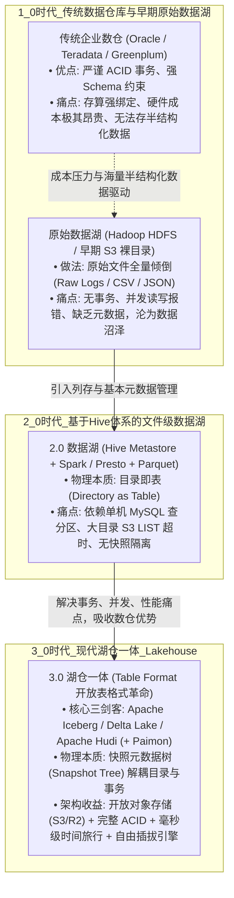
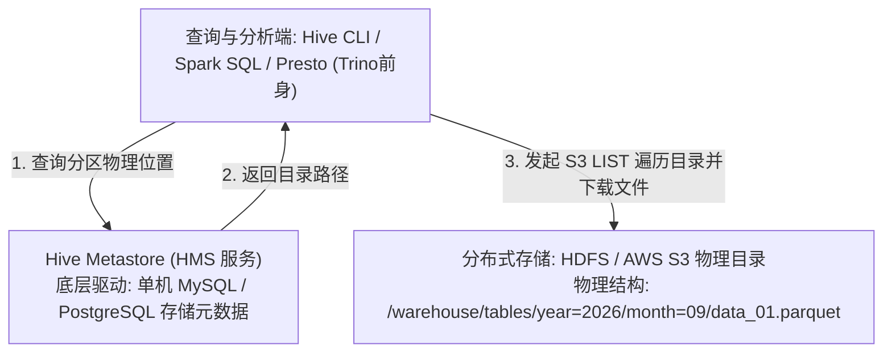
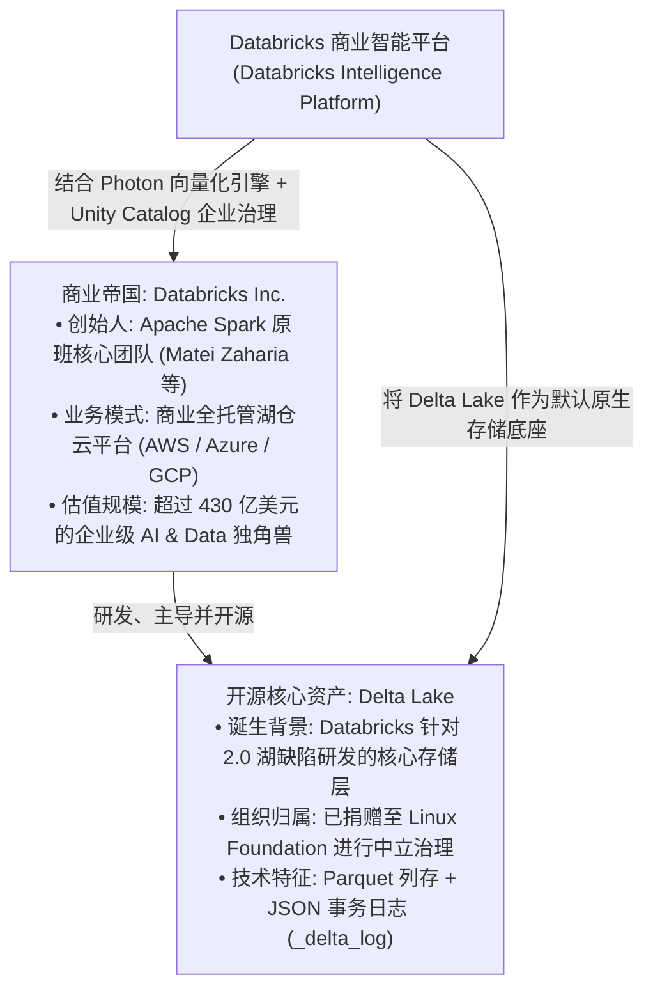

# 数据湖仓演进史：从封闭数仓、数据沼泽到现代化湖仓一体架构

本文档基于生产环境中的真实架构推演，系统性梳理大数据存储与计算范式从 1.0 时代到 3.0 时代的演进脉络，深入剖析传统数据仓库（Data Warehouse）、数据湖（Data Lake）与现代湖仓一体（Lakehouse）的底层物理机制，并厘清 Databricks 与 Delta Lake 的产业关系。

---

## 1. 概念基石：OLAP、数据仓库与数据湖的物理分水岭

在工业界的技术讨论中，经常存在将 OLAP、数据仓库与数据湖混为一谈的误区。要看清演进历史，必须先确立严密的判定标准。

### 1.1 OLAP 不等于数据湖，更不等于数据仓库
* **OLAP（联机分析处理）**：仅代表一种**计算与查询负载形态（Query Workload）**，其特征是大吞吐扫描、多维聚合、复杂计算与高延迟容忍度；
* 无论是 ClickHouse、Snowflake，还是 Trino、Spark，亦或是单机 PostgreSQL 的统计报表，都可以承担 OLAP 计算；
* **OLAP 无法决定底层是“湖”还是“仓”，它只代表上层业务“怎么用数据”。**

### 1.2 区分“仓”与“湖”的物理分水岭
区分一个系统到底是数据仓库还是数据湖，业界存在两个核心判定准则：

```text
              【判定准则一: 物理文件掌控权 (Vendor Lock-in)】
  
  ┌─────────────────────────────────┐     ┌─────────────────────────────────┐
  │      传统数据仓库 (Warehouse)      │     │      现代数据湖仓 (Lakehouse)     │
  ├─────────────────────────────────┤     ├─────────────────────────────────┤
  │ 数据被封闭在引擎私有二进制格式中     │     │ 数据以开放工业标准存储 (Parquet)   │
  │ 关掉 ClickHouse / Snowflake 进程 │     │ 关掉 Trino / Spark 计算集群     │
  │ 底层数据变成一堆无法读取的乱码碎片   │     │ 底层数据文件依然完好，任何引擎秒读  │
  └─────────────────────────────────┘     └─────────────────────────────────┘

              【判定准则二: Schema 约束时机 (Schema Enforcement)】
  
  * 数据仓库 (Schema-on-Write) : 写入前必须预先定义严格字段，数据削足适履清洗后方可入库。
  * 早期数据湖 (Schema-on-Read): 写入时不做强校验，原始文件直接堆积，读取时再动态解析。
```

---

## 2. 数据架构的三代演进史



---

### 2.1 1.0 时代：传统封闭数仓 vs 原始数据沼泽（2010 年前）

* **传统企业级数仓（Data Warehouse）**：
  * **代表体系**：Teradata、Oracle Exadata、Greenplum、IBM Netezza；
  * **架构特征**：高度集成的专有软硬件一体机（Appliance）或单体进程。采用集中式块存储，写入时强制 Schema 校验；
  * **致命瓶颈**：随着互联网海量日志与移动端数据爆发，专有存储的扩容成本呈指数级上升；同时无法处理音频、图像、多层嵌套 JSON 等非标准关系结构。
* **原始数据湖（Raw Data Lake）**：
  * **代表体系**：Hadoop HDFS、早期 AWS S3 裸目录；
  * **口号与定位**：“生肉存储，读时解析”。业务将原始日志、未清洗 CSV 全量倾倒入分布式文件系统，留作备查底账；
  * **演进结局（数据沼泽 Data Swamp）**：
    由于缺乏事务控制，写入中途故障会导致残缺文件残留；文件缺乏统计信息导致检索全表暴力扫描；同一份数据没人敢改、不敢删，最终堆积成废弃的数字垃圾场。

---

### 2.2 2.0 时代：基于 Hive Metastore 的文件级数据湖（2010 ~ 2020）

为了治理原始数据湖的混乱，业界确立了以 **Apache Hive 为核心的元数据标准**，形成了延续十年的“计算三驾马车 + Hive Metastore”格局：



#### 2.2.1 物理本质：“目录即表”（Directory as Table）
在 2.0 体系中，表的定义本质上是一个文件系统目录，分区则是子目录。例如：
`s3://lake-bucket/raw_sms/year=2026/month=09/`
系统认为该目录下的全部文件共同构成了这个分区的数据。

#### 2.2.2 2.0 架构的深层硬伤与翻车根源
1. **致命的 S3 文件列表扫描（S3 LIST API Bottleneck）**：
   对象存储不同于本地磁盘，调用 `LIST` 列举目录下文件需要按页发起 HTTP 请求。若单个分区内存在几万个小文件，计算引擎在开始读数据前，光是列出文件名就需要消耗 10 到 20 分钟；
2. **读写无快照隔离（Dirty Reads & Job Crash）**：
   写入任务正往 S3 目录里写 10 个新的 Parquet 文件，写到第 5 个时下游 Presto 恰好发起查询。Presto 读入一个未写完且没有 Footer 校验信息的残缺文件，瞬间触发 `EOFException` 导致查询任务崩溃；
3. **单行修改与删除的灾难（No In-place Update/Delete）**：
   面对 GDPR 隐私合规或业务冲正要求，若想删除某一行记录，必须把该文件甚至整个分区（数十 GB）全部加载到内存中重写一遍，计算成本与 I/O 开销巨大；
4. **元数据状态脱节（MSCK REPAIR TABLE）**：
   Spark 在存储桶新建了分区文件，Hive Metastore 并不会自动感知，必须人工或脚本执行耗时漫长的 `MSCK REPAIR TABLE` 重新扫描全量目录同步元数据。

---

### 2.3 3.0 时代：湖仓一体与现代开放表格式革命（2020 至今）

为了彻底根除 2.0 时代的物理设计缺陷，以 **Apache Iceberg、Delta Lake、Apache Hudi** 为代表的“开放表格式（Open Table Format）”应运而生。

3.0 时代将“表”的概念从“文件目录”提升为**“一棵层级自解释的原子快照树（Snapshot Tree）”**：

```text
3.0 湖仓核心解耦逻辑:
表结构定义不再由文件存储路径决定，而是由根节点 metadata.json 指向的快照决定。
任何写入必须在生成完整的元数据快照后，通过原子提交 (Atomic Commit) 盖章生效。
```

---

## 3. 深入解析：Databricks 与 Delta Lake 的产业与技术关系

在 3.0 湖仓生态中，很多人对 Databricks 与 Delta Lake 的界限感到模糊。两者分别属于商业实体与开源技术底座。



### 3.1 商业实体：Databricks
* **出身**：由加州大学伯克利分校 AMPLab 孵化出 Apache Spark 的核心团队成员创立；
* **产业地位**：全球湖仓一体概念的提出者与最大商业推动者，提供跨 AWS、Azure、GCP 的多云全托管大数据平台；
* **核心武器**：
  * **Photon 引擎**：采用 C++ 重写的高性能向量化查询引擎；
  * **Unity Catalog**：企业级跨工作区统一数据目录与数据治理安全中心。

### 3.2 开源表格式：Delta Lake
* **定位**：由 Databricks 设计并主导的高性能开放表格式，现已移交至 **Linux 基金会** 开源运营；
* **物理机制**：
  * **数据层**：采用标准的 Apache Parquet 列式存储；
  * **事务层（Delta Log）**：在表根目录下维护 `_delta_log/` 文件夹，每次数据写入原子生成一个递增的 JSON 文件（如 `000000.json`, `000001.json`），记录新增和删除的文件列表；
  * 每隔 10 个快照自动生成一个压缩检查点 Parquet 文件（`*.checkpoint.parquet`），保证事务日志回溯性能；
* **与 Apache Iceberg 的竞争格局**：
  * **Delta Lake**：在 Spark / PySpark 生态中处于统治地位，但早期与 Databricks 商业功能深度捆绑；
  * **Apache Iceberg**：由 Netflix 针对性研发并捐赠给 Apache，设计初衷即追求对 Spark、Trino、Flink 等多引擎绝对中立平等，目前已成为 Snowflake、Apple、AWS 等中立生态的共同选择。

---

## 4. 3.0 现代湖格式四大主流门派横向对比

| 特性对比维度 | Apache Iceberg | Delta Lake | Apache Hudi | Apache Paimon |
| :--- | :--- | :--- | :--- | :--- |
| **主导机构与背景** | Netflix 发起，Apache 顶级项目 | Databricks 发起，Linux 基金会 | Uber 发起，Apache 顶级项目 | 阿里巴巴发起，Apache 顶级项目 |
| **元数据架构** | 树状三层元数据：`metadata.json` ➔ Manifest List ➔ Manifest | 顺序提交的递增事务日志：`_delta_log/*.json` + Checkpoints | 文件级 Timeline 元数据 + 专用存储索引文件 | 针对流式场景定制的 LSM-Tree 结构文件 |
| **底层数据格式** | Parquet / ORC / Avro | Parquet | Parquet / ORC + 增量 Avro 日志 | Parquet / ORC |
| **计算引擎生态偏好** | **绝对中立**：Trino、Spark、Flink 同为第一公民 | **深度偏向 Spark**，其他引擎依赖专用连接器 | 偏向 Spark 与 Presto 批量分析 | **深度绑定 Apache Flink**，主打纯流式湖仓 |
| **并发事务控制 (ACID)** | 乐观并发控制 (OCC) + Catalog CAS 原子更新 | 乐观并发控制 (OCC) + 依赖文件系统租约/外部存储锁 | 乐观并发控制 (OCC) + 外部 ZooKeeper/DynamoDB 分布式锁 | 针对流式连续摄入优化的高频事务提交 |
| **细粒度数据更新方式** | Copy-on-Write (CoW) 与 Merge-on-Read (MoR) | Copy-on-Write (早期) 与 增量 Deletion Vectors | 强大的 Copy-on-Write 与 Merge-on-Read | 专为实时计算打造的 LSM-Tree 主键合并与预聚合 |
| **分区机制** | **隐藏分区（Hidden Partitioning）**：基于表达式，分区无感演进 | 传统物理目录分区（支持 Partition Pruning） | 物理目录分区 | 逻辑分区与 Bucket 桶级哈希拆分 |
| **最适配业务场景** | **通用企业级湖仓、实时批流入湖、Trino 交互式秒级 OLAP 探查** | 深度依赖 Spark/PySpark 进行大规模 ETL 与 AI 模型训练 | 物流、订单状态等高频 CDC 单行增量同步系统 | 毫秒级流式入湖、Flink 流批一体实时看板与物化视图 |

---

## 5. 架构演进总结

从传统数据库到现代湖仓，计算与存储的物理边界发生了一场清晰的技术解构：

1. **1.0 时代解决了“存得下”的问题**：以廉价分布式存储容纳全量原始数据，但牺牲了数据一致性与可用性；
2. **2.0 时代解决了“能检索”的问题**：以 Hive Metastore 与列式文件建立起初级数据目录，但缺乏现代事务支持，维护成本高昂；
3. **3.0 时代解决了“既要开放、又要严密”的问题**：通过 **Apache Iceberg / Delta Lake 等开放表格式**，在最通用、最廉价的对象存储底座上，复现了传统关系型数据库所有的核心事务保证（ACID、快照隔离、时间旅行），同时彻底消除了厂商专有格式锁定。

现代数据系统由此完成了**计算引擎（Flink / Trino / Spark）可自由替换、存储介质（S3 / R2）按需弹性伸缩、数据资产（Parquet + 表格式）永久开放**的三权分立终极架构闭环。
