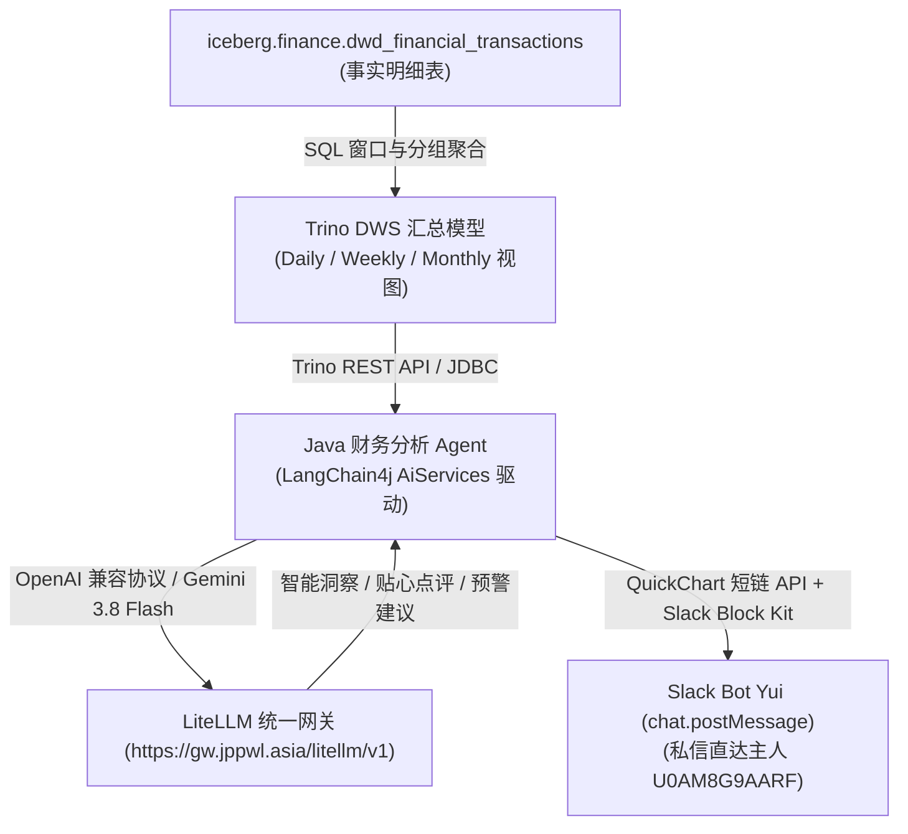

# 个人财务湖仓数仓服务层 (DWS) 与应用层 (ADS) 需求规格说明书
## 日 / 周 / 月 多维度财务汇总与报表体系 (Daily, Weekly, Monthly Financial Analytics)

> **文档版本**：v1.0.0  
> **更新时间**：2026-10-03  
> **数据基石**：`iceberg.finance.dwd_financial_transactions` (动账事实明细)  
> **目标系统**：个人智能化财务 Lakehouse 中台 (Trino / BI 看板 / 秘书推送)

---

## 1. 业务背景与建设目标

在完成 **ODS 原始层 (`raw_sms_records`)** 与 **DWD 动账事实明细层 (`dwd_financial_transactions`)** 的建设后，数据已经具备了高精度的金额、币种、出入流向、交易类型、卡号尾号、清洗商户名以及消费大类。

然而，明细数据是散列在各个时间切片中的单笔流水。为了满足主人对**资产变动全局掌控、生活开销趋势感知、异常大额支出预警**的需求，需要自底向上构建服务汇总层（DWS）与应用报表层（ADS）。

### 核心建设目标
1. **多颗粒度周期对齐**：原生支持**自然日 (Daily)**、**自然周 (Weekly · 周一至周日)**、**自然月 (Monthly · 自然月度)** 三大周期汇总；
2. **三维财务平衡计算**：严格区分 **消费支出 (EXPENSE)**、**退款冲正 (REFUND)**、**被动收入/理赔 (INCOME)** 以及 **资产划转/还款 (TRANSFER)**，计算真正的**净支出 (Net Expense)**；
3. **结构性开销透视**：在每个时间粒度下，自动产出按 **消费大类 (`category`)** 与 **核心商户 (`cleaned_merchant`)** 的聚合分布与环比趋势；
4. **轻量与实时响应**：依托 Apache Iceberg 隐藏分区与列存元数据，实现秒级甚至亚秒级的报表查询性能。

---

## 2. 统计口径与核心财务指标定义 (Metrics & Formulas)

为杜绝报表统计中的口径歧义，所有聚合模型严格遵循以下统一计算公式：

| 指标名称 (Metric) | 字段标识 | 计算口径与 SQL 表达式 | 业务意义 |
| :--- | :--- | :--- | :--- |
| **总消费笔数** | `tx_count` | `COUNT(1) FILTER (WHERE is_valid_tx = true AND tx_type = 'EXPENSE')` | 周期内真实刷卡/付款频次 |
| **总消费支出** | `total_expense` | `SUM(amount) FILTER (WHERE is_valid_tx = true AND direction = 'OUTFLOW' AND tx_type = 'EXPENSE' AND currency = 'CNY')` | 周期内总刷卡消费总额 (CNY) |
| **退款冲正金额** | `total_refund` | `SUM(amount) FILTER (WHERE is_valid_tx = true AND direction = 'INFLOW' AND tx_type = 'REFUND' AND currency = 'CNY')` | 电商取消、退货退回的资金 (CNY) |
| **实际净支出** | `net_expense` | `total_expense - total_refund` | 周期内真正消耗的个人可支配资金 |
| **保险理赔/进账** | `total_income` | `SUM(amount) FILTER (WHERE is_valid_tx = true AND direction = 'INFLOW' AND tx_type = 'INCOME' AND currency = 'CNY')` | 医疗理赔、车险赔偿、外部进账等资金回血 |
| **大额还款/划转** | `total_transfer` | `SUM(amount) FILTER (WHERE is_valid_tx = true AND direction = 'OUTFLOW' AND tx_type = 'TRANSFER' AND currency = 'CNY')` | 信用卡账单集中还款（不计入日常消费，避免双重扣款） |
| **外币交易金额** | `total_expense_usd` | `SUM(amount) FILTER (WHERE is_valid_tx = true AND currency = 'USD')` | 汇丰美元卡等境外/外币消费统计 |

> ⚠️ **核心审计防重规则**：
> 1. 所有聚合必须强校验门禁 `is_valid_tx = true`，严禁让验证码、授信广告计入金额；
> 2. `TRANSFER`（如广发信用卡 1.7 万元还款）**严格从日常消费中隔离**，独立作为流动性转移指标展示，防止统计月度生活费时出现严重失真。

---

## 3. 三大周期汇总模型规格设计

### 3.1 每日财务汇总模型 (Daily Financial Summary)
* **业务定位**：日终资产流水对账、异常大额支出即时预警、高频小额消费监控。
* **周期定义**：`Asia/Shanghai` 时区当天 `00:00:00` 至 `23:59:59`。
* **目标表/视图**：`iceberg.finance.dws_financial_summary_daily`

#### 字段规格：
| 字段名 | 物理类型 | 说明与示例 |
| :--- | :--- | :--- |
| `stat_date` | `DATE` | 统计日期，主维度键 (如 `2026-10-03`) |
| `day_of_week` | `INTEGER` | 星期几 (1 = 周一, 7 = 周日) |
| `is_weekend` | `BOOLEAN` | 是否为周末 (区分工作日通勤 vs 周末休闲消费) |
| `tx_count` | `BIGINT` | 当日有效消费笔数 |
| `total_expense` | `DECIMAL(12,2)` | 当日总消费支出 (CNY) |
| `total_refund` | `DECIMAL(12,2)` | 当日退款金额 (CNY) |
| `net_expense` | `DECIMAL(12,2)` | 当日净消费支出 (CNY) |
| `total_income` | `DECIMAL(12,2)` | 当日理赔到账金额 (CNY) |
| `total_transfer` | `DECIMAL(12,2)` | 当日信用卡还款等转账金额 (CNY) |
| `food_expense` | `DECIMAL(12,2)` | 当日餐饮美食开销 |
| `transport_expense`| `DECIMAL(12,2)` | 当日交通打车出行开销 |
| `shopping_expense` | `DECIMAL(12,2)` | 当日商超网购开销 |
| `medical_expense`  | `DECIMAL(12,2)` | 当日医疗药品支出 |
| `other_expense`    | `DECIMAL(12,2)` | 当日其他支出 |
| `max_single_amount`| `DECIMAL(12,2)` | 当日最大单笔支出金额 |
| `max_merchant`     | `VARCHAR` | 当日最大单笔支出的商户名 |

---

### 3.2 每周财务汇总模型 (Weekly Financial Summary)
* **业务定位**：周度生活开支节律回顾、周末家庭消费审计、预算消化进度追踪。
* **周期定义**：周一 `00:00:00` 起至周日 `23:59:59` 止（采用 ISO-8601 标准自然周）。
* **目标表/视图**：`iceberg.finance.dws_financial_summary_weekly`

#### 字段规格：
| 字段名 | 物理类型 | 说明与示例 |
| :--- | :--- | :--- |
| `stat_year` | `INTEGER` | 统计年份 (如 `2026`) |
| `stat_week` | `INTEGER` | 第几周 (ISO 周编号: 1 ~ 53) |
| `week_period` | `VARCHAR` | 自然周时间跨度标识 (如 `'2026-W40 (09-28 ~ 10-04)'`) |
| `week_start_date`| `DATE` | 该周周一对应日期 (如 `2026-09-28`) |
| `week_end_date` | `DATE` | 该周周日对应日期 (如 `2026-10-04`) |
| `tx_count` | `BIGINT` | 本周总有效动账笔数 |
| `total_expense` | `DECIMAL(12,2)` | 本周总消费支出 (CNY) |
| `total_refund` | `DECIMAL(12,2)` | 本周冲正退款总额 (CNY) |
| `net_expense` | `DECIMAL(12,2)` | 本周净开销总额 (CNY) |
| `avg_daily_expense`| `DECIMAL(12,2)` | 本周日均消费开销 (`net_expense / 7`) |
| `weekend_expense`| `DECIMAL(12,2)` | 周末两天开销总额 (周六 + 周日) |
| `weekday_expense`| `DECIMAL(12,2)` | 周中工作日开销总额 (周一至周五) |
| `top1_category` | `VARCHAR` | 本周开销占比第一的大类 |
| `top1_category_amt`| `DECIMAL(12,2)` | 该第一大类消费金额 |
| `top_merchants_json`| `VARCHAR` | 本周消费 Top 3 商户排行榜概要 |

---

### 3.3 每月财务资产负债大盘 (Monthly Financial Balance)
* **业务定位**：权威月度账单结算、净储蓄率核算、各大行信用卡对账。
* **周期定义**：自然月 1 日 `00:00:00` 至该月最后一日 `23:59:59`。
* **目标表/视图**：`iceberg.finance.dws_financial_summary_monthly`

#### 字段规格：
| 字段名 | 物理类型 | 说明与示例 |
| :--- | :--- | :--- |
| `stat_month` | `VARCHAR` | 统计月份主键 (如 `'2026-09'`) |
| `tx_count` | `BIGINT` | 全月总消费交易笔数 |
| `total_expense_cny`| `DECIMAL(12,2)`| 全月人民币总支出 (如 `36213.26`) |
| `total_refund_cny` | `DECIMAL(12,2)`| 全月退款冲抵金额 (如 `241.80`) |
| `net_expense_cny` | `DECIMAL(12,2)`| **全月人民币净支出** (如 `35971.46`) |
| `total_income_cny` | `DECIMAL(12,2)`| 全月被动收入/理赔总额 (如 `2790.59`) |
| `total_transfer_cny`| `DECIMAL(12,2)`| 全月信用卡集中还款流水 (如 `17253.33`) |
| `total_expense_usd`| `DECIMAL(12,2)`| 全月外币/美元信用卡消费 (如 `11.98`) |
| `cgb_expense_cny` | `DECIMAL(12,2)`| 广发卡消费总额 (尾号 3342 对账专用) |
| `boc_expense_cny` | `DECIMAL(12,2)`| 中国银行房贷/供款流水对账专用 |
| `food_expense` | `DECIMAL(12,2)`| 全月餐饮美食总额与占比 |
| `transport_expense`| `DECIMAL(12,2)`| 全月交通打车总额与占比 |
| `shopping_expense` | `DECIMAL(12,2)`| 全月电商生活购物总额与占比 |
| `medical_expense`  | `DECIMAL(12,2)`| 全月医疗健康开销总额 |
| `other_expense`    | `DECIMAL(12,2)`| 全月其他支出 (车险保单等) |

---

## 4. 辅助维度专题汇总表 (Dimensional Marts)

为了支撑前端看板交互与排行榜渲染，需配套建立两大专用多维分析视图：

### 4.1 核心商户排行榜 (Merchant Spending Mart)
* **目标模型**：`iceberg.finance.dws_merchant_spending_ranking`
* **分析维度**：按自然月 / 自然周，聚合统计 `cleaned_merchant`：
  * 该商户在周期内的**总消费金额**
  * 该商户在周期内的**刷卡/付款频次**
  * 该商户的**笔均客单价**（`total_amt / tx_cnt`）
  * 该商户在总消费中的**渗透率占比 (%)**

### 4.2 支付通路与卡种对账表 (Channel & Account Mart)
* **目标模型**：`iceberg.finance.dws_account_channel_summary`
* **分析维度**：按月统计：
  * **支付通路分布**：支付宝（`ALIPAY`）vs 微信支付（`WECHAT_PAY`）vs 直连扣款（`DIRECT`）vs 银联（`UNIONPAY`）金额比例；
  * **主卡消耗监控**：广发 3342 主卡的当月实际已出账单模拟。

---

## 5. 数据消费与报表展现形式 (Application & Serving)

### 5.1 场景 A：Trino 直连秒级 Ad-hoc 查询
所有聚合逻辑优先使用 **Trino SQL View（视图）** 实现。
* **零存储与计算冗余**：不增加额外批处理维护成本，依托 Iceberg 底层隐藏分区剪枝，全量聚合在 0.1~0.3 秒内返回；
* **随时随地即席查询**：主人在 DBeaver、CLI 或任何客户端执行 `SELECT * FROM iceberg.finance.dws_financial_summary_monthly` 即可获取最新大盘。

### 5.2 场景 B：BI 数据可视化大屏 (Metabase / Superset)
通过在集群配置轻量 BI 工具，自动生成以下仪表盘组件：
1. **指标卡片**：本月净开销、今日消费、本周日均；
2. **走势折线图**：近 30 天每日净支出波动曲线（标记周末消费波峰）；
3. **环形占比图**：五大消费类目分布（餐饮 / 交通 / 购物 / 医疗 / 其他）；
4. **横向柱状图**：本月商户 Top 10 排行榜。

### 5.3 场景 C：Yui 专属 Slack 私聊机器人推送 (Yui Financial Bot via Slack)
在传统固化的冷冰冰数字报表之上，引入 **Slack 官方 Bot「Yui」作为主人的贴身财务秘书与私密播报员**。
Yui 通过 Slack 原生 Web API（`chat.postMessage`）与主人（`U0AM8G9AARF`）建立 1 对 1 私信连接，以富文本卡片（Slack Block Kit）结合 **LLM 智能洞察与秘书温存点评**，推送**每日睡前账单、每周财务体检与每月资产白皮书**：

#### 1. Yui 机器人配置与凭证规范 (Bot Configuration)
* **App 名称**: `Yui` (App ID: `A0BCF2GNXDZ`)
* **消息接口**: `https://slack.com/api/chat.postMessage`
* **目标接收人**: 主人专属私信 Channel ID: `U0AM8G9AARF`
* **核心授权 Scopes**:
  * `chat:write`（以 Yui 的身份发送消息）
  * `im:write` / `im:read` / `im:history`（发起并管理与主人的私人会话）
  * `files:write`（未来支持将月度消费图表或 CSV 直接作为附件上传）
* **安全凭证注入**: 环境变量 `SLACK_YUI_BOT_TOKEN`（在 Kubernetes `sms-flink-secret` 中安全挂载）

#### 2. LLM 输入上下文组装 (Context Prompt Architecture)
将 DWS 周期聚合指标与精选明细组装为结构化 JSON 提示词：
```json
{
  "period_type": "WEEKLY",
  "period_label": "2026-W40 (09-28 ~ 10-04)",
  "metrics": {
    "total_expense": 489.50,
    "total_refund": 43.92,
    "net_expense": 445.58,
    "avg_daily": 63.65,
    "weekend_pct": "61.2%"
  },
  "top_categories": [
    {"category": "TRANSPORT", "amount": 186.40, "pct": "41.8%"},
    {"category": "FOOD", "amount": 142.30, "pct": "31.9%"},
    {"category": "SHOPPING", "amount": 116.88, "pct": "26.3%"}
  ],
  "top_merchants": [
    {"merchant": "高德打车", "amount": 186.40, "count": 6},
    {"merchant": "知味园自选快餐", "amount": 65.20, "count": 3}
  ],
  "anomalies_or_highlights": [
    "医疗理赔到账 ￥279.95 (中意人寿)",
    "周末打车频次较工作日增加 120%"
  ]
}
```

#### 3. LLM 输出层级与点评维度 (AI Review Dimensions)
* **开销节律把脉 (Spending Rhythm)**：分析日常开销节奏是否健康、周末是否存在冲动消费或集中餐饮/娱乐波峰；
* **异常动向提示 (Anomaly Detection)**：发现单笔异动、订阅扣款提醒、大额还款后可用额度推算；
* **储蓄与预算优化建议 (Actionable Advice)**：对比历史周/月趋势，给出针对性建议（例如：“主人本周高德打车占了40%以上的日常开销，如果长途通勤较多，可以关注一下高德打车月卡权益哦～”）；
* **资产回血与理赔对账提醒**：结合理赔到账记录，提示主人报销款已冲抵部分支出。

#### 4. 三大周期的 Yui Slack 消息样式 (Slack Block Kit Format)
* ☕ **每日晚间（22:30）· 睡前财务轻播报 (Daily Bedtime Summary)**：
  > 包含当日精选卡片：总支出、净开销、分类小饼图概览，附 Yui 温存点评：
  > *“主人晚上好～Yui 陪您过目今日账单：今天共支出 3 笔 ￥72.80，全部是必要的通勤与快餐，今天很自律哦！早点休息，明天又是元气满满的一天，晚安主人～🛌”*
* 📅 **周日晚间（23:00）· 周度财务体检与点评 (Weekly Financial Health Check)**：
  > 包含周度总览、工作日 vs 周末消费对比、Top 3 消费商户、Yui 节律诊断建议：
  > *“主人周末愉快！本周 (W40) 净支出 ￥445.58，日均 ￥63.65。支出第一大项是‘交通出行’（打车 6 次共 ￥186.40）。欣慰的是中意人寿理赔 ￥279.95 已顺利回血～整体财务状况处于【极佳健康】区间！”*
* 🏆 **每月 1 日 · 月度资产与消费白皮书 (Monthly Financial Whitepaper)**：
  > 全月资产汇总大卡片、各大行信用卡对账状态、资产负债率变动、次月预算规划。

---

## 6. 数据架构与落地方案设计 (Technical Architecture)



### 6.1 核心技术栈选型与规范 (Tech Stack & Conventions)
* **大模型 Agent 框架**: **`LangChain4j` (版本: `0.35.0`+)**
  * 模块依赖：`dev.langchain4j:langchain4j-open-ai`（轻量独立，零 Spring 捆绑）；
  * 编程模式：**声明式 `AiServices`**，定义 `FinancialAdvisorService` 接口，配合 `@SystemMessage` 与 `@UserMessage` 动态代理生成；
* **LLM 网关与调度链路 (姿势 A · 统一网关)**:
  * 端点地址：`https://gw.jppwl.asia/litellm/v1`（或内网 `http://10.0.1.227:9090/v1`）；
  * 后端驱动主力模型：**`gemini-3.8-flash`**（高推理智商、低延迟、超大上下文）；
  * 授权凭证：Yui 专属虚拟 Key (`sk-WhW6BWdwKN_LITjCuAmgiA`)；
  * 核心优势：享受 LiteLLM 统一路由、多 Key 轮询容灾以及故障自动降级；
* **图表可视化引擎**:
  * **QuickChart 官方标准短链 API** (`POST https://quickchart.io/chart/create`)；
  * 自动将环形饼图 (`doughnut`) 与横向柱状图 (`horizontalBar`) 转换为标准静态短链图片；
* **消息展现载体**:
  * **Slack Block Kit**（以 Yui 身份私聊直达主人 `U0AM8G9AARF`）。

---

## 7. 后续实施路径规划 (Roadmap)

1. **第一阶段 (Step 1 · 视图层就绪 - 已完成 ✅)**：
   * 编写 `scripts/schema-dws.sql` 与 `schema-dws-dev.sql`，在 Trino 中创建 4 大 DWS 视图；
   * 生产与测试环境通过 Trino 全量指标交叉对账，平账验证 100% 成功。
2. **第二阶段 (Step 2 · LangChain4j Agent 与 Yui Slack 引擎构建)**：
   * 引入 `langchain4j-open-ai` 依赖；
   * 实现声明式 `FinancialAdvisorService`，对接私有 LiteLLM 网关调度 `gemini-3.8-flash`；
   * 实现 `QuickChartClient` 生成图表短链，组装 Slack Block Kit 发送器；
   * 编写 JUnit 测试，本地运行生成 9 月度全景图文分析报告。
3. **第三阶段 (Step 3 · 云原生定时自动化调度)**：
   * 结合 `JobLauncher`，将分析播报任务挂载为 K3s 定时任务（或在 GitHub Actions 每日晚间触发）；
   * 每天 22:30 自动生成日简报，每周日晚自动推送周点评。
