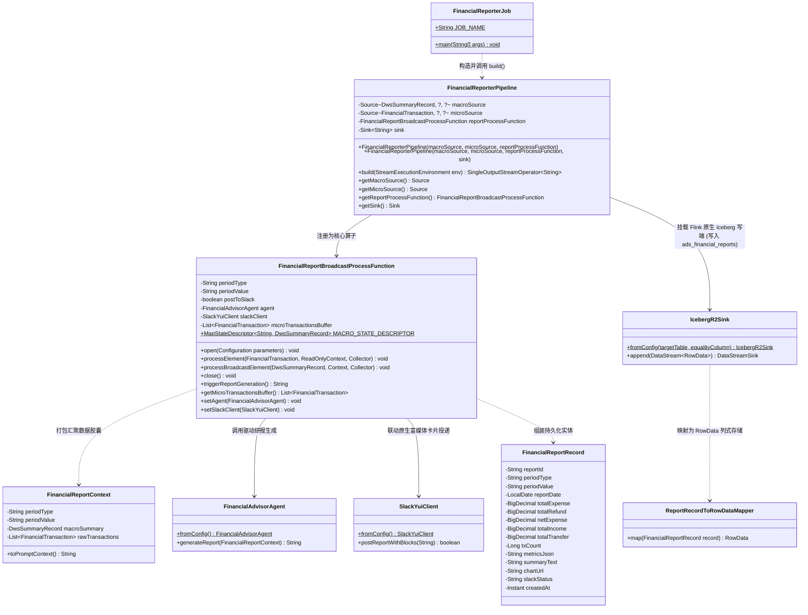

# Flink 批流一体报表系统类设计文档：FinancialReport 核心三层架构设计

> **文档标识**：`docs/financial-reporter-flink-pipeline-class-design.md`  
> **所属模块**：Milestone 2 (M2) · 报表流水线层  
> **设计原则**：依赖倒置 (DIP)、关注点分离 (SoC)、高内聚低耦合、流批一体与高可测试性  
> **涉及核心类**：
> 1. `com.finance.etl.transform.report.FinancialReportBroadcastProcessFunction` (双流广播汇聚算子)
> 2. `com.finance.etl.pipeline.FinancialReporterPipeline` (拓扑编排实体)
> 3. `com.finance.etl.jobs.FinancialReporterJob` (批处理调度运行器入口)
> 4. `com.finance.etl.transform.report.FinancialReportBroadcastProcessFunctionTest` (算子单测)
> 5. `com.finance.etl.pipeline.FinancialReporterPipelineTest` (拓扑集成测试)

---

## 1. 架构定位与设计哲学

在现代分布式湖仓与 AI 智能体系统中，单纯的“离线脚本调用大模型”或“算子内部直连数据库穿透查询”都存在严重的工程破绽（网络 I/O 激增、破坏批处理纯净性、大模型幻觉不可控等）。

本架构严格遵循企业级 **三层经典分工**，建立起 Flink 分布式底座与 LangChain4j 智能体之间的健壮桥梁：

```text
 ┌────────────────────────────────────────────────────────┐
 │ 1. 调度运行层: FinancialReporterJob (Main Class)       │  <-- 负责 CLI 参数解析、环境初始化、湖仓数据探查与作业提交
 └───────────────────────────┬────────────────────────────┘
                             │ 组装并委托 (Dependency Injection)
                             ▼
 ┌────────────────────────────────────────────────────────┐
 │ 2. 拓扑编排层: FinancialReporterPipeline               │  <-- 负责纯 Flink DataStream DAG 编排 (面向 Source/Sink 抽象编程)
 └───────────────────────────┬────────────────────────────┘
                             │ 挂载执行算子 (.process())
                             ▼
 ┌────────────────────────────────────────────────────────┐
 │ 3. 核心算子层: FinancialReportBroadcastProcessFunction │  <-- 负责双流广播汇聚、内存状态维护、驱动 Agent 与 Slack 投递
 └────────────────────────────────────────────────────────┘
```

---

## 2. 核心类结构与 Mermaid 协作关系



---

## 3. 详细类规格定义与职责说明

### 3.1 核心算子类：`FinancialReportBroadcastProcessFunction`

* **全限定名**：`com.finance.etl.transform.report.FinancialReportBroadcastProcessFunction`
* **基类规范**：`org.apache.flink.streaming.api.functions.co.BroadcastProcessFunction<FinancialTransaction, DwsSummaryRecord, String>`
* **设计意图**：
  将主流中成千上万条无规律的微观刷卡记录，与广播流中经过严格会计平账核验的 1 行宏观大盘统计，在算子本地 JVM 堆内存中合二为一，消除外部数据库并发穿透与网络瓶颈。

#### 核心属性定义：
| 属性名 | 类型 | 修饰符 | 语义描述 |
| :--- | :--- | :--- | :--- |
| `MACRO_STATE_DESCRIPTOR` | `MapStateDescriptor<String, DwsSummaryRecord>` | `public static final` | 广播状态描述符，用于在状态后端声明宏观统计存储字典 |
| `periodType` | `String` | `private final` | 统计周期类型：`DAILY`、`WEEKLY`、`MONTHLY` |
| `periodValue` | `String` | `private final` | 周期具体值：如 `2026-10-05`、`2026-09` |
| `postToSlack` | `boolean` | `private final` | 是否自动将研报推送到 Slack（单元测试时置为 `false`） |
| `agent` | `FinancialAdvisorAgent` | `private transient` | 持有的 LangChain4j 智能体本体实例 |
| `slackClient` | `SlackYuiClient` | `private transient` | 持有的 Slack Web API 客户端实例 |
| `microTransactionsBuffer` | `List<FinancialTransaction>` | `private transient` | 周期内流式累加接收的微观交易事实流水池 |

#### 关键生命周期与方法实现：
1. **`open(Configuration parameters)`**：
   - 算子初始化，从单例配置工厂拉起 `FinancialAdvisorAgent.fromConfig()` 和 `SlackYuiClient.fromConfig()`；
   - 实例化 `microTransactionsBuffer` 内存明细缓冲区。
2. **`processBroadcastElement(DwsSummaryRecord macroRecord, Context ctx, Collector<String> out)`**：
   - 处理广播端数据：接收从 Trino 视图查得的宏观记录，以 `periodValue` 为 Key 存入广播状态后端 `ctx.getBroadcastState(MACRO_STATE_DESCRIPTOR)`。
3. **`processElement(FinancialTransaction transaction, ReadOnlyContext ctx, Collector<String> out)`**：
   - 处理主流明细：逐条将到达的主流事实流水缓冲到 `microTransactionsBuffer` 中。
4. **`close()` 与 `triggerReportGeneration()`**：
   - 在有界批处理数据消费完毕后触发；
   - 提取宏观统计与微观流水，组装领域对象 `FinancialReportContext`；
   - 调用 `agent.generateReport(context)` 驱动大模型自主决策、调用 QuickChart 工具生成图表短链并返回 Markdown 正文；
   - 若 `postToSlack=true`，则调用 `slackClient.postReportWithBlocks(report)` 以 Slack 原生图片卡片形式送达用户；
   - 向下游 Collector 发射研报正文。

---

### 3.2 拓扑编排实体类：`FinancialReporterPipeline`

* **全限定名**：`com.finance.etl.pipeline.FinancialReporterPipeline`
* **设计意图**：
  实现完全的**控制反转与依赖倒置（DIP）**。该类不硬编码任何具体的 JDBC 连接、Kafka 配置或 S3 路径，仅面向 `Source` 与 `Sink` 接口编排 Flink DAG，具备极高的可替换性与可测试性。

#### 构造函数声明：
```java
public FinancialReporterPipeline(
    Source<DwsSummaryRecord, ?, ?> macroSource,
    Source<FinancialTransaction, ?, ?> microSource,
    FinancialReportBroadcastProcessFunction reportProcessFunction
);

public FinancialReporterPipeline(
    Source<DwsSummaryRecord, ?, ?> macroSource,
    Source<FinancialTransaction, ?, ?> microSource,
    FinancialReportBroadcastProcessFunction reportProcessFunction,
    Sink<String> sink
);
```

#### 拓扑装配逻辑 (`build` 方法)：
```java
public SingleOutputStreamOperator<String> build(StreamExecutionEnvironment env) {
    // 1. 从 macroSource 读取宏观大盘流并广播
    DataStream<DwsSummaryRecord> macroStream = env
            .fromSource(macroSource, WatermarkStrategy.noWatermarks(), "Macro-DwsSummary-Source")
            .uid("macro-dws-source");

    BroadcastStream<DwsSummaryRecord> broadcastMacroStream = macroStream
            .broadcast(FinancialReportBroadcastProcessFunction.MACRO_STATE_DESCRIPTOR);

    // 2. 从 microSource 读取微观明细流
    DataStream<FinancialTransaction> microStream = env
            .fromSource(microSource, WatermarkStrategy.noWatermarks(), "Micro-DwdTransaction-Source")
            .uid("micro-dwd-source");

    // 3. 双流连接汇聚并强制锁定单例并行度 (Parallelism = 1)
    SingleOutputStreamOperator<FinancialReportRecord> reportStream = microStream
            .connect(broadcastMacroStream)
            .process(reportProcessFunction)
            .name("FinancialReport-Broadcast-ProcessFunction")
            .uid("financial-report-process")
            .setParallelism(1);

    // 4. 挂载 Flink 原生 Iceberg 写端 (写入 ads_financial_reports 物理持久化表)
    // 严格遵循工程 Lakehouse 原生规范：复用 IcebergR2Sink + ReportRecordToRowDataMapper
    if (sink != null) {
        reportStream.sinkTo(sink).name("FinancialReport-Sink").uid("financial-report-sink");
    } else {
        IcebergR2Sink adsSink = IcebergR2Sink.fromConfig("ads_financial_reports", "report_id");
        DataStream<RowData> rowStream = reportStream
                .map(new ReportRecordToRowDataMapper())
                .name("ReportRecord-To-RowData")
                .uid("report-to-rowdata");
        adsSink.append(rowStream);
    }

    return reportStream;
}
```

---

### 3.3 统一调度批作业入口类：`FinancialReporterJob`

* **全限定名**：`com.finance.etl.jobs.FinancialReporterJob`
* **设计意图**：
  作为外部生产环境（Linux Crontab、DolphinScheduler、Airflow 或 CLI）触发的独立 Main 函数入口，驱动有界批处理任务的完整生命周期。

#### 核心能力：
1. **灵活的 CLI 参数解析**：
   - `--period DAILY` / `--date 2026-10-05`：指定某一天，生成日度财务轻播报；
   - `--period MONTHLY` / `--month 2026-09`：指定某一月份，生成全景资产战略白皮书；
   - 缺省时自动调用 `FinancialLakehouseRepository` 探测数据库中最新有动账流水的自然日。
2. **批执行环境治理**：
   - 严格声明 `env.setRuntimeMode(RuntimeExecutionMode.BATCH)`，批执行完成立即释放 TaskExecutor 资源；
   - 支持从配置读取 `FLINK_PARALLELISM`。
3. **有界源映射适配**：
   - 将 JDBC / Repository 探查出的单条宏观大盘和多条微观流水，分别封装为 Flink 标准批源（`DataGeneratorSource`）；
   - 组装 `FinancialReporterPipeline` 并调用 `env.execute()` 提交作业。

---

## 4. 自动化测试套件设计

针对上述模块，配套设计两个维度的轻量化自动化测试，确保在脱离复杂网络和大模型的情况下也能秒级回归：

### 4.1 算子单元测试：`FinancialReportBroadcastProcessFunctionTest`
* **测试类路径**：`src/test/java/com/finance/etl/transform/report/FinancialReportBroadcastProcessFunctionTest.java`
* **测试用例**：`testTriggerReportGenerationWithMock()`
* **断言重点**：
  1. 使用匿名 Fake 类注入 `FinancialAdvisorService`，拦截真实大模型远程 HTTP 调用；
  2. 模拟微观交易流入缓冲区；
  3. 执行 `triggerReportGeneration()`；
  4. 断言：Agent 被成功触发，返回预期的 Mock 内容，且在单测模式下不会向 Slack 发出外部请求。

### 4.2 流水线拓扑测试：`FinancialReporterPipelineTest`
* **测试类路径**：`src/test/java/com/finance/etl/pipeline/FinancialReporterPipelineTest.java`
* **测试用例**：`testBuildPipelineGraph()`
* **断言重点**：
  1. 初始化本地 Flink 批处理环境；
  2. 使用 `DataGeneratorSource` 构造确定性的 1 行宏观数据和 1 条微观流水；
  3. 驱动 `pipeline.build(env)`；
  4. 断言：生成的 Flink 物理执行计划字符串 `env.getExecutionPlan()` 中明确包含 `FinancialReport-Broadcast-ProcessFunction` 节点，证明 DAG 编译成功且通道连接无死锁。

---

## 5. 架构演进收益总结

1. **零数据库穿透压力**：算子内部无任何数据库连接池或 DAO 调用，避免高并发下打崩 Trino 或 Iceberg 元数据。
2. **零大模型数字幻觉**：宏观指标来自已平账的 DWS 视图，微观明细来自真实 DWD 流水，由 Flink 算子打包为完整上下文喂给 Agent，模型只做推理分析与可视化调用，绝无伪造数据的空间。
3. **原生 Lakehouse 持久化闭环**：研报分析成果不走临时 JDBC 插入，而是通过 Flink 原生 `IcebergR2Sink` 以 Parquet 列存格式直接写入 Cloudflare R2 上的 `ads_financial_reports` 物理事实表，天然拥有 V2 Equality Delete Upsert 与版本快照管理能力。
4. **符合企业级规范**：完全对齐项目中 `SmsGmailR2Pipeline` 与 `SmsOdsToDwdPipeline` 的命名与职责规范，代码整洁一致。
