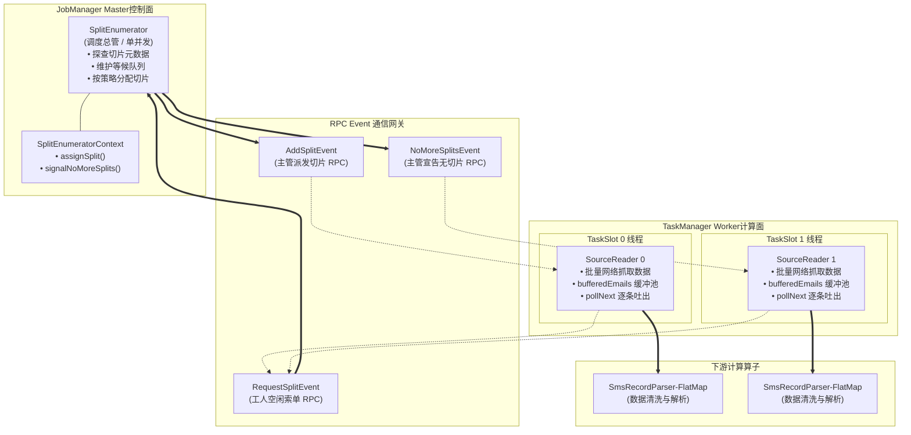
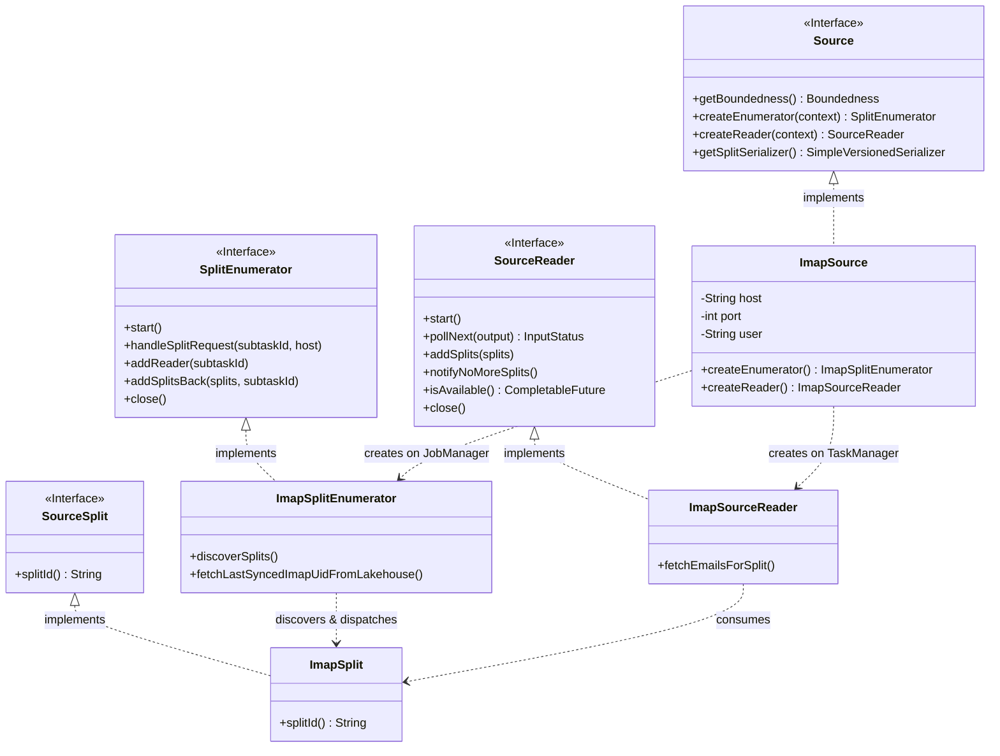
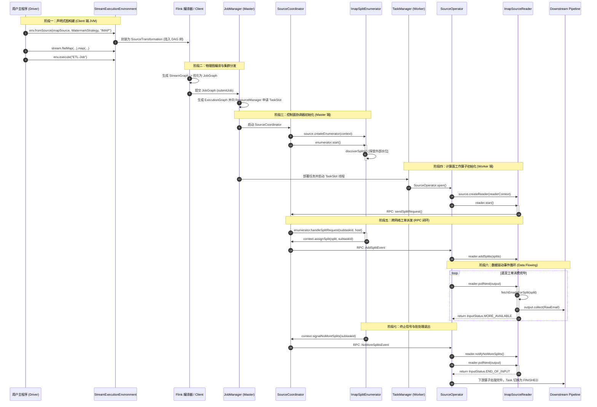
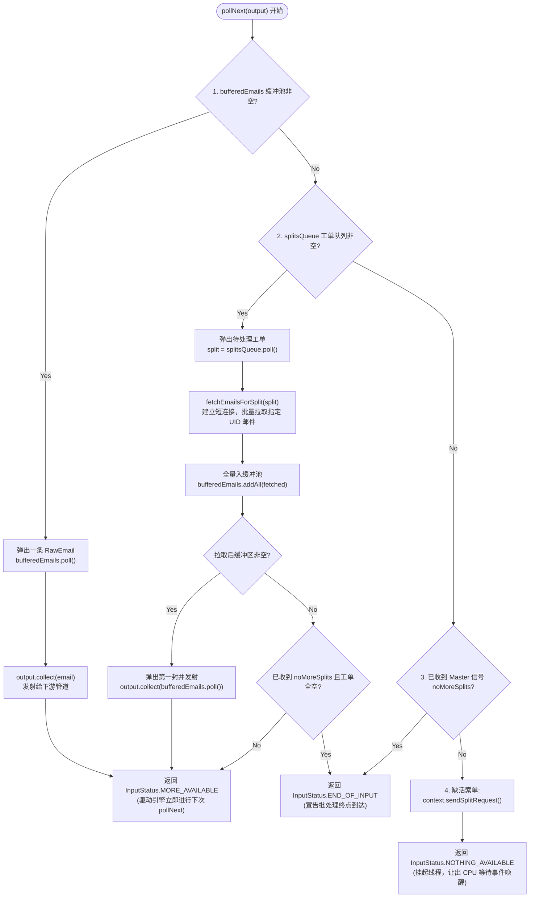
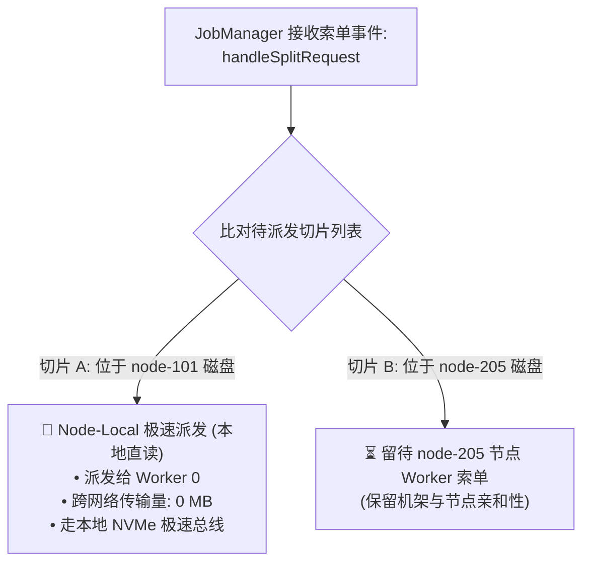

# 深入解构 Flink FLIP-27 数据摄取内核：从 env.execute() 到工业级 Source 运行机制

在流批一体大数据计算引擎中，数据摄取（Data Ingestion）是整个计算拓扑的生命线与起点。长期以来，Apache Flink 早期基于 `SourceFunction` 的摄取模型在流批统一性、动态分片伸缩（Work Stealing）、状态快照解耦以及数据本地性（Data Locality）调度上存在天然缺陷。

为了解决这一历史债务，Flink 社区推出了全新的统一数据源架构——**FLIP-27（Refactor Source Interface）**。该架构不仅彻底重构了流与批的物理抽象，更确立了主从（Coordinator-Worker）解耦、拉推协同（Pull-Based Scheduling）的分布式摄取典范。

本文将剥离所有表面语法糖，直击 JVM 线程与 Netty RPC 通信层，系统拆解 FLIP-27 的四大核心实体、类协同拓扑、全链路方法调用网络，并逐毫秒还原从用户调用 `env.execute()` 到第一条业务数据被下游管道消费的完整多米诺骨牌级触发链条。

---

## 1. FLIP-27 核心设计哲学：流批统一与主从物理分离

在传统的 `SourceFunction` 中，一个并发实例既要负责探查外部存储的分区（如 Kafka Partitions、文件切片），又要负责拉取数据并处理 Checkpoint 锁。这种将“任务切分调度”与“数据拉取”混杂在单节点的做法，导致批处理作业无法动态分派工单，更无法实现精准的跨机器负载均衡。

FLIP-27 的核心设计哲学建立在严格的**职责单向分离（Separation of Concerns）**之上：



### 1.1 架构三原则
1. **Master 只管指针，Worker 负责搬砖**：
   `SplitEnumerator` 运行在 JobManager 上，只探查元数据指针（切片信息，如文件名、Offset 范围、邮件 UID），绝不读取业务数据报文，彻底免疫 Master 节点的 OOM（Out Of Memory）崩溃风险。
2. **拉模型为主，推拉结合（Pull-Based Driven）**：
   Worker 节点主动索要工单（`sendSplitRequest`），Master 依据各 Worker 的负载状况与数据本地性按需派发，天然支持“能者多劳”的 Work Stealing 动态负载均衡。
3. **数据流与控制流分离**：
   控制流走 Flink 内部 RPC Event 网关；数据流直接走 ReaderOutput 流向紧邻的下游算子，实现零拷贝直通。

---

## 2. FLIP-27 四大基石组件深度剖析

FLIP-27 体系由四个核心抽象构建而成，各自承载着明确的生命周期职责：



### 2.1 Source (顶层门面工厂)
- **定义**：`org.apache.flink.api.connector.source.Source<T, SplitT, EnumChkT>`
- **泛型约束**：
  - `T`：Source 吐出的业务数据记录类型（如 `RawEmail`）。
  - `SplitT`：切片描述符类型，必须继承 `SourceSplit`（如 `ImapSplit`）。
  - `EnumChkT`：Enumerator 的状态快照类型（若无需状态可声明为 `java.lang.Void`）。
- **生命周期与职责**：
  - 作为用户 API 的统一入口，向 `StreamExecutionEnvironment` 注册。
  - 声明数据流的边界特征（`getBoundedness()`）：`BOUNDED`（有界批处理）或 `CONTINUOUS_UNBOUNDED`（无界流处理）。
  - 提供运行时工厂方法：在 JobManager 端调用 `createEnumerator()` 创建调度总管；在 TaskManager 端调用 `createReader()` 创建读取工人。
  - 提供序列化协议器：`getSplitSerializer()` 负责工单跨网络的二进制编解码，`getEnumeratorCheckpointSerializer()` 负责快照状态序列化。

### 2.2 SourceSplit / ImapSplit (切片工单)
- **定义**：`org.apache.flink.api.connector.source.SourceSplit`
- **物理本质**：切片不是数据本体，而是**抓取数据的指示票据（Work Order）**。
- **设计规范**：
  - 必须提供全局唯一的 `splitId()`。
  - 状态纯粹不可变（Immutable POJO/DTO）。
  - 仅包含元数据。以 IMAP 邮件摄取为例，`ImapSplit` 只封装 `folderName`、`startUid`、`endUid` 或离散的 `specificUids` 集合，大小通常只有几十字节，跨节点网络传输极度轻量。

### 2.3 SplitEnumerator (调度协调主管)
- **定义**：`org.apache.flink.api.connector.source.SplitEnumerator<SplitT, CheckpointT>`
- **物理宿主**：运行在 JobManager 的 `SourceCoordinator` 内部，**全局单并发单线程**。
- **核心职能**：
  - **切片探查（Discovery）**：在启动时或周期性连接数据源元数据层（如湖仓元表、Kafka Broker、Gmail IMAP），切分出逻辑工单列表。
  - **工人打卡登记（Worker Registration）**：通过 `addReader(int subtaskId)` 记录存活的 Worker 工位。
  - **派单调度（Dispatching）**：响应 Worker 的索单网络事件，通过 `context.assignSplit(split, subtaskId)` 下发工单。
  - **工单退回与容错（Fault Tolerance）**：当下游某个 Worker 崩溃或网络断开时，框架回调 `addSplitsBack(List<SplitT> splits, int subtaskId)`，调度主管将未消费完成的工单收回并重新加入待分配队列。
  - **完工收敛（Termination）**：当全部切片分配完毕，调用 `context.signalNoMoreSplits(subtaskId)` 向 Worker 下发终止信号。

### 2.4 SourceReader (工作执行单元)
- **定义**：`org.apache.flink.api.connector.source.SourceReader<T, SplitT>`
- **物理宿主**：运行在 TaskManager 的 `SourceOperator` 内部，**由并发度决定的多并发实例**。
- **核心职能**：
  - **索单驱动**：启动时调用 `context.sendSplitRequest()` 向 JobManager 发送拉单 RPC 请求。
  - **接单缓存**：框架通过 `addSplits(List<SplitT> splits)` 将工单推入 Reader 内部的工单队列。
  - **数据搬运与缓冲**：针对工单建立物理连接，批量抓取原始报文，写入内部行缓冲区（如 `Queue<RawEmail>`）。
  - **流式递送**：在引擎驱动的事件循环中通过 `pollNext(ReaderOutput<T> output)` 将数据逐条推入下游，并返回自身就绪状态（`InputStatus`）。

---

## 3. 调度主管与工作单元的协作交互网络

在分布式运行环境下，JobManager 与 TaskManager 通过底层基于 Pekko/Netty 的事件网关实现非阻塞异步交互。整个协作过程呈现高度对称的“请求-响应”拓扑。

### 3.1 跨节点核心方法调用映射表

| 触发方 (Client 端) | 底层 RPC 事件 (Wire Protocol) | 接收处理方 (Server 端回调) | 业务语义 |
| :--- | :--- | :--- | :--- |
| `readerContext.sendSplitRequest()` | `RequestSplitEvent` | `enumerator.handleSplitRequest(subtaskId, host)` | Worker 空闲，向 Master 索要新分片工单 |
| `enumContext.assignSplit(split, subtask)` | `AddSplitEvent` | `reader.addSplits(List<SplitT> splits)` | Master 审核通过，向指定 Worker 工位派发工单 |
| `enumContext.signalNoMoreSplits(subtask)` | `NoMoreSplitsEvent` | `reader.notifyNoMoreSplits()` | Master 通知 Worker：当前已无后续分片，准备收尾 |
| `TaskManager` 建立连接 | `RegisterReaderEvent` | `enumerator.addReader(int subtaskId)` | Worker 物理线程就绪，向 Master 报道注册工位 |
| `TaskManager` 发生异常宕机 | `SourceEvent` (Failover) | `enumerator.addSplitsBack(splits, subtask)` | 故障转移：框架自动退回未处理分片，等待重分 |

### 3.2 为什么必须设计等待队列：异步启动的竞态条件（Race Condition）

在分布式系统中，JobManager 与 TaskManager 是解耦启动的。以单 Pod 内嵌式批处理为例：
- Worker 线程启动极快，微秒级即可进入 `reader.start()` 并触发 `context.sendSplitRequest()`。
- Master 线程在 `enumerator.start()` 中需要连接外部系统（如读取数据库 Watermark、连接外部服务探查），网络 I/O 阻塞可能耗时数秒。

如果 Master 没有维护等待状态，Worker 先发出的索单 RPC 就会遗失。因此，工业级 `SplitEnumerator` 必须建立等待名单机制：

```java
// Master 端维护的工位排队名单
private final Set<Integer> subtasksAwaitingSplits = new HashSet<>();
private boolean splitsDiscovered = false;

@Override
public synchronized void handleSplitRequest(int subtaskId, @Nullable String requesterHostname) {
    if (!splitsDiscovered) {
        // 主管还在连外部网络查数据，先将工人工号记入等候室
        subtasksAwaitingSplits.add(subtaskId);
    } else {
        // 数据已就绪，立即派单
        assignNextSplit(subtaskId);
    }
}
```

一旦 Master 的探查逻辑执行完毕（`splitsDiscovered = true`），立即回溯清算：

```java
for (int subtaskId : new ArrayList<>(subtasksAwaitingSplits)) {
    assignNextSplit(subtaskId);
}
subtasksAwaitingSplits.clear();
```
这一机制从根本上杜绝了分布式异步初始化时的线程饥饿与假死。

---

## 4. 全链路执行轨迹：从 env.execute() 到数据落盘

许多开发者认为写完 `env.fromSource(...)` 数据就已经在读取了。实际上，Flink 采用的是纯粹的**惰性执行（Lazy Evaluation）**。在 `env.execute()` 触发前，所有代码仅是在 JVM 堆内存中绘制一张抽象语法图。

以下是完整的物理时序流转：



---

## 5. pollNext() 方法的物理内部：缓冲队列与状态反馈

`SourceReader.pollNext(ReaderOutput<T> output)` 是数据流动的物理心脏。理解该方法必须理清其**流式接口设计理念**：该方法不以“返回值”传递数据，而是以**管道漏斗注入（Collector Push）**传递数据，以**枚举状态（InputStatus）**反馈执行状态。



### 5.1 返回值状态机的三大语义
1. **`InputStatus.MORE_AVAILABLE`**：
   Worker 明确告知底层调度引擎：“我手头还有数据待处理（缓冲区非空），请立刻进行下一次循环调用。”该状态会促使 Flink 紧凑占用该线程的 CPU 时间片，实现纳秒级高速数据吞吐。
2. **`InputStatus.NOTHING_AVAILABLE`**：
   Worker 告知引擎：“工单队列目前为空，但我正在等待网络 I/O 响应或等待 Master 派单。”此时 Reader 内部会向引擎挂载一个 `CompletableFuture` 探针（`isAvailable()`），引擎收到后主动挂起该任务线程并让出 CPU，避免无意义的空轮询（Spin Wait）。
3. **`InputStatus.END_OF_INPUT`**：
   这是**批处理（Mode B） run-to-completion 生命周期的终点哨音**。当工单队列清空、内部缓冲区清空且 Master 已经下发 `noMoreSplits` 信号时触发。该信号向上逐级击穿调用链，促使 `SourceOperator` 触发 `finish()`，并顺流而下向紧邻的下游算子（FlatMap、Sink）广播结束标志，驱动整个 JobGraph 优雅走向 `FINISHED`。

### 5.2 生产级网络吞吐与抗超时调优（双王牌策略）
在公网 IMAP 邮件摄取实践中，传统 JavaMail 极易陷入两类性能深渊：
1. **正文批量整包预取（消灭 N+1 次网络往返）**：
   默认情况下，`folder.fetch(messages, fp)` 仅拉取信封元数据，当在循环中调用 `msg.getContent()` 时会产生多达 N 次同步网络阻塞。本架构强制在 `FetchProfile` 中追加 `IMAPFolder.FetchProfileItem.MESSAGE` 指令，命令服务端一次性下发整包，将多次跨洋请求压缩至单次 I/O，耗时从数十秒暴降至秒级；
2. **连接超时与流控保护（消灭 10 秒死等）**：
   通过 `ImapUtils` 统一将连接与读取超时调优至 5 秒（`timeout=5000`），启用 1MB 预取缓冲区（`fetchsize=1048576`）并禁用分段小包（`partialfetch=false`），彻底规避频繁小请求诱发的服务端限流与长时间挂起。

---

## 6. 生产级进阶：为什么 handleSplitRequest 带有 requesterHostname？

在阅读 Flink `SplitEnumerator` 源码时，接口方法签名中包含一个常被初学者忽略的参数：

```java
void handleSplitRequest(int subtaskId, @Nullable String requesterHostname);
```

在大数据分布式存储（HDFS、Alluxio、本地混合存储）场景下，该参数承载着核心战略使命——**数据本地性调度（Data Locality）**。

### 6.1 计算向数据移动（Moving Computation Towards Data）
跨物理机房或跨网络机架搬运 10TB 数据块的代价极其昂贵。通过在 RPC 索单事件中携带 Worker 所在的物理机器标识 `requesterHostname`，Master 能够实现机架亲和性匹配：



1. **Node-Local（节点本地）**：Master 优先将物理存储位于 `node-101` 磁盘上的切片派发给该节点上的 Worker，数据直接走本地 NVMe 磁盘总线与 OS 缓存，**跨网络流量为 0**。
2. **Rack-Local（机架本地）**：次选同机架网络交换机节点，降低核心骨干网络负载。
3. **Any-Host（异地网络传输）**：最后兜底策略。

在公网数据源场景（如 Gmail IMAP 或公网 S3）中，由于所有 Worker 均必须经由网卡访问公网，物理上不存在本地文件块，因此该参数在实现类中标记为 `@Nullable` 并安全忽略，但这一设计展示了 FLIP-27 接口应对超大规模集群调度时的普适性与深厚工业底蕴。

---

## 7. 结语：工业级摄取架构的收益

通过将数据摄取体系解构为 `Source`、`ImapSplit`、`ImapSplitEnumerator` 与 `ImapSourceReader` 四大正统实体：

1. **内存确定性**：Master 仅感知轻量级工单，彻底根绝元数据膨胀诱发 Master 节点 OOM 的可能。
2. **作业弹性与容错**：分片支持双向退单（`addSplitsBack`），下游 Worker 遭遇物理抖动或抢占时，未竟分片可被其他 Worker 丝滑继承。
3. **架构内聚与可维护性**：外部协议层细节（如连接池、SSL/TLS 参数构造）可收拢于专属工具类（如 `ImapUtils`），上层逻辑面向纯粹的 Flink 运行时契约编程，保证核心拓扑历经版本迭代仍具备极高的稳定性与演进能力。
