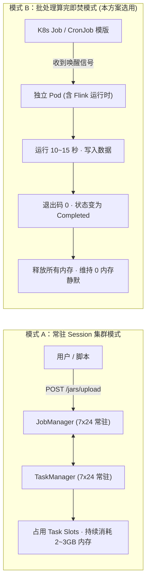
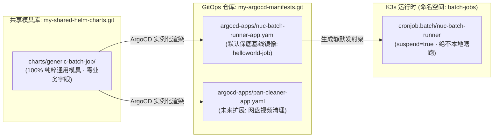

# Flink 极简入门与零常驻批处理架构实战：从双模式辨析到 GitOps 通用模具治理

在构建个人金融动账 Lakehouse（从邮件/短信增量抓取，清洗写入 Apache Iceberg，最终供 Trino 查询分析）的过程中，计算引擎选型自然落在了成熟的大数据事实标准 **Apache Flink** 上。

但在实际把 Flink 搬进我的家庭边缘算力底座（Intel NUC `Nova` 物理机，K3s 集群 Worker 节点）时，我遇到了一个关键分歧：**Flink 到底应该怎么部署？** 

如果直接按照网上一搜一大把的教程，在 Kubernetes 里拉起一套常驻的 JobManager 和 TaskManager，一台闲置内存 12GB+ 的 NUC 立刻就会被吃掉近 3GB 内存，而且绝大部分时间它们只是在空转看表。对于每天只跑几批、每次处理耗时十几秒的增量批处理任务来说，这种常驻运维纯属资源浪费。

这篇文章记录了我从零摸索 Flink 批处理架构、推翻常驻 Session 模式、用 ArgoCD + 通用 Helm 模具重构“算完即焚”执行底座，并彻底治愈架构洁癖的完整技术复盘。

---

## 一、 方案全景与端到端拓扑

整个系统的核心愿景是：**业务驱动、按需唤醒、算完即焚、零常驻开销**。

```mermaid
flowchart TD
    subgraph DataSources ["数据输入层"]
        Sms["手机交易动账短信 (广发/微信/支付宝)"] --> MailRelay["邮件中继 (163 SMTP)"]
        MailRelay --> Gmail["Alice Gmail 邮箱 (IMAP 993)"]
    end

    subgraph TriggerChain ["调度与触发链路 (云端精准指挥)"]
        AWS["AWS EventBridge Scheduler (新加坡机房 · cron 每4小时)"]
        GHA["GitHub Actions 调度编排中枢"]
        AWS -->|HTTPS POST| GHA
    end

    subgraph EdgeCompute ["边缘算力中心 (Intel NUC / K3s)"]
        GHA -->|唤醒指令| K3sTrigger["kubectl create job --from=cronjob/..."]
        
        subgraph EphemeralPod ["一次性执行实体 (运行 15 秒即焚)"]
            K3sTrigger --> Runner["Flink Batch Runner (JDK 21)"]
            Runner --> Source["EmailImapBatchSource (短连接拉取)"]
            Source --> Transform["Map & Transform 算子"]
            Transform --> Sink["IcebergBatchSink (S3A 直写)"]
        end
    end

    subgraph StorageLakehouse ["开放数据湖仓底座"]
        Sink -->|Parquet 列存 + Snapshot| R2["Cloudflare R2 (Iceberg Warehouse · 零出网费)"]
        Trino["Trino MPP 查询引擎 (NUC 常驻 · 960MB)"] -->|元数据下推直读| R2
        Trino --> WebUI["Trino Web UI / DBeaver 交互查账"]
    end

    subgraph Observability ["全链路可观测体系"]
        Runner -.->|stdout 输出| FluentBit["Fluent Bit (DaemonSet)"]
        FluentBit -.->|Tailscale 专网推流| VLogs["VictoriaLogs (星光板 RISC-V)"]
    end

    EphemeralPod -.->|跑完退出 (Completed)| MemoryFree["100% 释放内存物归原主"]
```

整个链路环环相扣：
1. **数据源**：交易短信汇聚在 Gmail 作为原始报文缓冲区；
2. **云端精准吹哨**：由 AWS EventBridge Scheduler 维持北京时间（`Asia/Shanghai`）每 4 小时吹一次哨，向 GitHub Actions 发起调用，本地无需常驻外部 Web 监听；
3. **本地算完即焚**：NUC 收到指令，就地复印一个独立的 Job Pod，启动内嵌 Flink 引擎，15 秒内拉取数据写入 Cloudflare R2 上的 Apache Iceberg 表，随即正常退出；
4. **统一湖仓查账**：同驻 NUC 的轻量 Trino 引擎直读 R2，提供毫秒级 ANSI SQL 检索与时间旅行（Time Travel）审计。

---

## 二、 Flink 两种运行模式的深度较量

在 Kubernetes 环境下运行 Flink，必须搞清两种截然不同的部署哲学。



### 1. 模式 A：Session 集群模式（常驻共享）
* **运行形态**：在集群里常驻一个 JobManager Deployment 和若干 TaskManager Deployment，暴露 8081 Web 控制台。
* **作业流程**：本地打出 Fat JAR，通过 REST API（`POST /jars/upload`）将 JAR 包推到 Flink Server，然后调用 `POST /jars/{jarid}/run` 触发计算。
* **致命缺点**：
  * **内存空转**：平时就算没有任何数据流入，JobManager (1G) 和 TaskManager (2G) 也得钉死在内存里；
  * **排障时间倒挂**：Session 模式通过 REST 提交任务时，JobManager 的 `main()` 方法通常以异步托管方式运行，客户端执行 `env.execute()` 提交完 JobGraph 就立刻退出了，此时 TaskManager 甚至还没来得及分配 Slot。这会导致日志打印出“提交成功”，但实际计算还没开始，排查日志时极易被误导；
  * **容器日志丢失**：官方 Flink 容器在 K8s 下默认日志只走标准输出，未落盘到内部磁盘，在 Web 控制台点开 TaskManager Logs 会直接报 `FileNotFoundException`。

### 2. 模式 B：Application 纯批处理模式（算完即焚，本方案选用）
* **运行形态**：将 Flink Runtime、依赖库与业务代码统一打包成一个自包含的 Docker 镜像，在 K8s 中声明为 `Job` 或 `CronJob`。
* **作业流程**：平时**没有正在运行的 Pod，内存占用为 0**。调度触发时，K8s 动态拉起容器，执行 `java -Xmx1536m -jar app.jar`，内置的 Flink MiniCluster 秒级完成初始化、消费、入湖并自动退出（Exit Code 0），Pod 状态变为 `Completed`。
* **核心收益**：
  * **极致省钱省算力**：平时在 NUC 物理机上维持 **0 CPU、0 内存** 绝对静默；
  * **镜像即版本**：每一个镜像 Tag 对应一次 Git Commit，可追溯性极强；
  * **云原生标准可观测**：容器的标准输出被节点上的 Fluent Bit 秒级搬进 VictoriaLogs，不需要打开 Flink 网页，直接用统一日志看板检索。

---

## 三、 从业务耦合到架构洁癖：通用 Helm 模具重构

在选定模式 B 后，最容易犯的一个工程毛病是：**把具体的业务参数直接硬编码在底层清单里**。

我最初在 GitOps 仓库（`my-argocd-manifests`）里的写法是：
```text
infrastructure/flink/
└── flink.yaml   # 里面写死了 name: flink-sms-batch-etl, image: .../sms-flink-batch-etl
```
这种写法存在两个严重的架构坏味道：
1. **名不副实**：目录叫 `infrastructure/flink`，看起来像个平台级通用设施，结果里面全是 `sms` 短信业务的专用配置；以后如果想加一个“清理网盘视频”或者“拉取支付宝账单”的批处理任务，根本无法复用；
2. **多头调度冲突**：在 YAML 里写了 `schedule: "0 */4 * * *"`，导致云端 AWS EventBridge 吹一次哨，本地 K3s 系统时钟又跑一次，两个闹钟很容易走偏、甚至引发重复并发冲突。

为了彻底治愈这种架构瑕疵，我实施了彻底的**解耦重构**：



### 1. 打造纯粹的通用模具：`generic-batch-job`
在我的通用 Helm 模具库 `my-shared-helm-charts` 中，新建了一个与 Web 服务平级的通用批处理模具 `charts/generic-batch-job/`。

它的核心模板（`templates/cronjob.yaml`）完全不包含任何业务词汇，全部由占位符组成：
```yaml
apiVersion: batch/v1
kind: CronJob
metadata:
  name: {{ include "generic-batch-job.fullname" . }}
  labels:
    {{- include "generic-batch-job.labels" . | nindent 4 }}
spec:
  schedule: {{ .Values.schedule | quote }}
  suspend: {{ .Values.suspend }}
  concurrencyPolicy: {{ .Values.concurrencyPolicy | default "Forbid" }}
  successfulJobsHistoryLimit: {{ .Values.successfulJobsHistoryLimit | default 3 }}
  failedJobsHistoryLimit: {{ .Values.failedJobsHistoryLimit | default 5 }}
  jobTemplate:
    spec:
      template:
        spec:
          restartPolicy: {{ .Values.restartPolicy | default "OnFailure" }}
          nodeSelector:
            {{- toYaml .Values.nodeSelector | nindent 12 }}
          containers:
            - name: batch-runner
              image: "{{ .Values.image.repository }}:{{ .Values.image.tag }}"
              imagePullPolicy: {{ .Values.image.pullPolicy | default "IfNotPresent" }}
              resources:
                {{- toYaml .Values.resources | nindent 16 }}
```

### 2. 调度权 100% 移交云端 (`suspend: true`)
在 values 默认定义中加上死锁保护：
* **`suspend: true`**：告诉本地 K8s，“平时闹钟永久关停，绝对禁止你自己按时钟启动！”；
* **`schedule: "0 0 31 2 *"`**：填上 2 月 31 日这个永不触发的幽灵时间作为占位符。

这样一来，本地集群只保留**静态图纸（发射架）**，实际何时启动完全由外部云端指令说了算。

### 3. ArgoCD 业务实例化对齐
在 GitOps 仓库中彻底删除了手写的 `infrastructure/flink` 孤儿目录，只在 `argocd-apps/nuc-batch-runner-app.yaml` 里用几十行 Helm values 完成实例化：

```yaml
apiVersion: argoproj.io/v1alpha1
kind: Application
metadata:
  name: nuc-batch-runner
  namespace: argocd
spec:
  project: default
  source:
    repoURL: 'https://github.com/nvd11/my-shared-helm-charts.git'
    path: charts/generic-batch-job # 引用纯粹通用模具
    targetRevision: HEAD
    helm:
      values: |
        fullnameOverride: nuc-batch-runner
        suspend: true
        image:
          repository: ghcr.io/nvd11/helloworld-job
          tag: latest
        nodeSelector:
          kubernetes.io/hostname: "nuc"
  destination:
    name: 'tencent-dp1-cluster'
    namespace: batch-jobs
```

---

## 四、 编译与交付全链路实战

整个代码与交付流水线遵循高内聚、低耦合原则。

### 1. JDK 21 编译与反射封装绕行
由于 Java 21 对底层模块实施了强封装，Flink 内部内存管理与 Hadoop S3A 反射需要开启模块通道。在 `pom.xml` 和 `Dockerfile` 中必须显式配置：

```dockerfile
ENTRYPOINT ["java", \
    "--add-opens=java.base/java.lang=ALL-UNNAMED", \
    "--add-opens=java.base/java.lang.reflect=ALL-UNNAMED", \
    "--add-opens=java.base/java.util=ALL-UNNAMED", \
    "--add-opens=java.base/java.util.concurrent=ALL-UNNAMED", \
    "--add-opens=java.base/java.nio=ALL-UNNAMED", \
    "--add-opens=java.base/sun.nio.ch=ALL-UNNAMED", \
    "-Xmx1536m", \
    "-jar", "/app/sms-flink-etl-1.0.0.jar"]
```

### 2. GitHub Actions 路径过滤流水线 (`build-helloworld-job.yml`)
为了防止同一个仓库里不同 Job 的修改互相干扰，CI 采用精准路径过滤（Path Filtering）：

```yaml
name: Build and Push HelloWorld Job Image

on:
  push:
    branches: [ main ]
    paths:
      - "src/main/java/com/finance/etl/HelloWorldJob.java" # 仅当该类修改时触发
      - "src/main/resources/**"
      - "pom.xml"
      - "Dockerfile"
      - ".github/workflows/build-helloworld-job.yml"
```
代码推送到 `main` 分支后，GitHub Actions 自动构建并将镜像推送到 GHCR：
`ghcr.io/nvd11/helloworld-job:latest`。

### 3. 关于 GHCR 免密拉取的一个关键教训
在调试 K3s 拉取镜像时，最初报过 `401 Unauthorized: failed to fetch anonymous token`。
排查发现：**如果 GitHub 源码仓库本身是 Private，推送到 GHCR 的新包默认也会被强制盖上 Private 锁**，导致 K3s 节点无法匿名拉取。

解决方式很简单：
```bash
# 将代码仓切换为 Public，后续推送的全新 Package 将自动继承 Public 属性，免密秒拉：
gh repo edit nvd11/sms-flink-etl --visibility public --accept-visibility-change-consequences
```

---

## 五、 作业触发与实地观测验证

当这套通用底座在 K3s 落地后，触发运行变得极度轻盈。

### 1. 手动即席触发与执行
在需要临时跑一次任务时，直接用一条命令从母版中克隆：

```bash
sudo kubectl create job --from=cronjob/nuc-batch-runner manual-run-01 -n batch-jobs
```

在 NUC 物理机上观察实际执行过程：
```bash
$ sudo kubectl get pods -n batch-jobs -w
NAME                  READY   STATUS              AGE
manual-run-01-gl5xk   0/1     ContainerCreating   0s
manual-run-01-gl5xk   0/1     Running             2s
manual-run-01-gl5xk   0/1     Completed           11s
```
* **耗时**: 仅仅存活了 **11 秒**；
* **内存**: 任务退出后，1.5GB 内存被 Linux 内核全额回收，系统再次恢复到闲置可用 12GB+ 状态。

### 2. VictoriaLogs 结构化集中观测
容器在 11 秒里喷出的日志，已经被宿主机上的 Fluent Bit 自动投递到了 VictoriaLogs。打开 VMUI（`http://10.0.1.227:9428/select/vmui/`），输入一条 LogSQL：

```sql
_stream:{kubernetes.namespace_name="batch-jobs"} | sort by (_time) asc
```

就能看到按物理时间精准正序排列的完整生命周期：
```text
2026-09-26 23:49:57 [main] INFO - 🚀 Submitting SMS Flink ETL JobGraph to Cluster Dispatcher...
2026-09-26 23:49:57 [Nova-Worker-Slot] INFO - Processed message: Hello Boss Jason! Flink 1.19 is running gracefully on NUC Nova!
2026-09-26 23:49:57 [Nova-Worker-Slot] INFO - Processed message: Verified Stack: AWS Scheduler -> GitHub Actions -> NUC Flink -> Cloudflare R2 Iceberg -> Trino.
2026-09-26 23:49:57 [main] INFO - Job SMS-Flink-ETL-HelloWorld-Verification switched from state RUNNING to FINISHED.
2026-09-26 23:49:57 [main] INFO - Shut down complete.
```

---

## 六、 总结与架构思考

通过推翻常驻 Session 集群、自研 `generic-batch-job` 通用 Helm 模具，这套方案在有限的个人算力硬件上实现了几个核心平衡：

1. **算力效率与闲置成本的平衡**：在家庭边缘物理机上，坚决不为低频批处理任务维持常驻进程，把宝贵的物理内存留给真正需要常驻的 Trino 查询引擎与网关；
2. **调度职责与系统稳定性的平衡**：将容易断电、时间走偏的定时器责任上收至云端（AWS EventBridge + GitHub Actions），本地通过 `suspend: true` 彻底消除多时钟冲突；
3. **平台抽象与业务正交的平衡**：无论是底层的通用模具、通用的发射架还是默认镜像，彻底剥离业务特定字眼；未来加入网盘清理或大模型后处理等任何算完即焚任务，只需要替换一条镜像参数，架构的扩展性得到了真正的解放。
