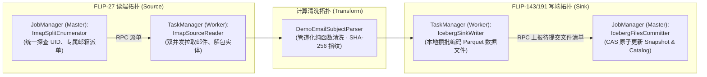

# Apache Iceberg + Cloudflare R2 湖仓落地 Sink 架构设计规格书

本文档作为 **SMS Flink ETL** 项目中写端（Sink / Writer）的核心架构设计规范，系统性阐述为什么不需要手写底层 Writer、Flink 现代 Sink 体系与 FLIP-27 Source 的镜像对称架构、漏斗形单并发控制（`writeParallelism = 1`）以及具体的代码工程分层实现。

---

## 1. 设计哲学：为什么我们不需要手写底层 Writer？

在整个端到端 ETL 流水线中，读端（Source）与写端（Sink）面对的协议与工业生态完全不同，直接决定了两者的工程实现策略：

```
【读端：定制造轮子】                                      【写端：站在巨人肩膀上】
Gmail IMAP (1988年办公协议)                               Apache Iceberg (现代开源湖仓事实标准)
         │                                                         │
   无分区、无并发设计                                         标准化 Parquet 列存 + Snapshot 元数据
         │                                                         │
必须纯手搓 FLIP-27 连接器                                   官方提供工业级 iceberg-flink-runtime
(自研 UID 探查、切片、专属邮箱派单)                          (直接复用 FlinkSink，严禁重复发明轮子)
```

- **读端必须手写**：IMAP（RFC 3501）是一个针对人类用户的办公邮件协议，底层收件箱只有平坦单一的文件列表，无任何并行概念。为了在 Flink 中跑出毫秒级双并发，必须由我们自研 FLIP-27 `ImapSource` 强行进行虚拟分区（Splits）与派单调度。
- **写端无需手写**：Apache Iceberg 是被全世界顶级大数据引擎（Flink, Spark, Trino, DuckDB）共同遵守的开放标准。官方已经投入数万工程时，在 `FlinkSink` 中封装了工业级的内存攒批、Parquet 列存二进制编码、Bloom Filter 索引生成、分区路径路由与两阶段快照提交。
- **我们的职责定位**：**我们不是底层存储引擎开发者，而是金融湖仓管道的装配建筑师**。我们唯一需要关注的是**类型投影映射、存储与元数据凭据装配、以及拓扑并发控制**。

---

## 2. Flink 现代写端架构解析：FLIP-143 / FLIP-191 与 FLIP-27 的镜像对称

Flink 批处理并非简单的 `for-each` 单条写库，而是基于 **FLIP-143 (Unified Sink API) 与 FLIP-191 (Sink V2)** 规范构建的两阶段分布式写入体系。

它与我们刚刚实现的 FLIP-27 Source 在架构哲学上构成了高度对称的“镜像双生子”：



### 核心协作生命周期（Mode B 批处理模式下）
1. **Worker 搬砖（`IcebergStreamWriter`）**：各 TaskSlot 将上游吐出的 `RowData` 流在内存中规整为 RowGroup，写成临时的 `.parquet` 数据文件，在 `END_OF_INPUT` 到达时封装为待提交凭据（`WriteResult` / `Committable`）；
2. **Master 终态卡口（`IcebergFilesCommitter`）**：在作业跑完的最后一刻（Run-to-Completion），收集全部已写成的 Parquet 物理文件路径，打包成新的 `Snapshot` 和 `ManifestFile`，向 CockroachDB 的 Catalog 发送一次 CAS（Compare-And-Swap）事务性提交；
3. **元数据落稳，作业注销**：更新全局表版本指针，作业优雅退出并释放 100% 内存。

---

## 3. 核心并发决策：漏斗形拓扑与 `writeParallelism = 1`

### 3.1 全链路并发拓扑（前宽后窄）

```
[ Gmail IMAP (公网) ]
        │
        ├── (1/2) Worker Slot 0 [拉取 100 封] ──┐  并发度 = 2 (压榨网络与多核算力)
        └── (2/2) Worker Slot 1 [拉取 100 封] ──┤
                                                │
                                                ▼  
                     [ DemoEmailSubjectParser 实体清洗 & SHA-256 提取 ] (并发度 = 2)
                                                │
                                                │  (本地内存轻量汇聚 Forward)
                                                ▼  
                                      [ Iceberg Writer ] (writeParallelism = 1)
                                                │  仅产出 1 个紧凑的 Parquet 文件
                                                ▼  
                                     [ Iceberg Committer ] (强制单并发 = 1)
                                                │  原子提交快照，更新 CockroachDB
                                                ▼  
                                    [ Cloudflare R2 Lakehouse ]
```

### 3.2 为什么写端必须强制收敛为单一 Worker（三大根因）

1. **彻底根除小文件碎片化灾难 (Small File Problem)**：
   - 本作业是定时增量批处理，单批次处理的动账短信通常在 **数十至两百条** 之间；
   - 200 条记录经 Parquet 列存压缩后，体积仅有 **区区 30~50 KB**；
   - 若沿用全局双并发写入，每个批次会分裂出两个 15~25 KB 的微型小文件，长期运行将在 Cloudflare R2 堆积数千个垃圾小文件，严重拖垮下游 Trino 的读取扫描与元数据剪枝性能；
   - 锁定 `writeParallelism = 1`，保证每次定时批处理**产出且仅产出 1 个致密的高压缩比标准 Parquet 文件**。
2. **Cloudflare R2 API 计费优化**：
   - Cloudflare R2 免除了昂贵的数据出网流量费（Zero Egress），但按 Class A 操作（PUT 写入请求）计费；
   - 写入并发收敛为 1，直接将每次批处理的 PUT 请求量与 Manifest 元数据文件数压缩至理论极小值。
3. **本地计算开销极低**：
   - 读端并发是由于面对跨洋公网与代理延迟；
   - 写端在 Intel NUC 本地将 200 条数据编码为 Parquet 并上传 R2，**单线程耗时仅需不到 50 毫秒**，完全无需为了微秒级收益牺牲湖仓物理结构的健康度。
4. **Committer 线性原子性保证**：
   - 负责向 CockroachDB 提交元数据快照的 `IcebergFilesCommitter`，其并发度被 Flink 与 Iceberg 底层**强制锁定为 1**，保证元数据提交必须具备绝对的线性一致性。

---

## 4. 详细类职责规范与三道工序

流水线写端逻辑划分为清晰的三道工序，彻底杜绝逻辑糊在 `main()` 里的反模式：

```text
com.finance.etl
│
├── sink.iceberg                        <-- [湖仓写端专职包]
│   ├── SmsRecordToRowDataMapper.java   # 【工序①】类型投影：SmsRecord (POJO) -> RowData
│   └── IcebergR2Sink.java              # 【工序②】写端门面实体：组装 S3A、Catalog 并返回 DataStreamSink
│
├── repository                          <-- [湖仓元数据仓储层]
│   └── IcebergOffsetRepository.java    # 【工序③】共享仓储：etl_sync_offsets 增量水位读写闭环 (解耦读写双端)
│
├── pipeline
│   └── SmsGmailR2Pipeline.java         # 【工序④】总图编排：将 Source -> Parser -> Sink 装配成完整 DAG
│
└── jobs
    └── SmsGmailR2Job.java              # 执行入口：纯参数驱动，启动 Flink 运行环境
```

---

### 4.1 工序 ①：类型投影映射器 (`SmsRecordToRowDataMapper`)
* **接口**：`implements MapFunction<SmsRecord, RowData>`
* **包路径**：`com.finance.etl.sink.iceberg`
* **设计定位**：纯函数、无状态。将高内聚的业务领域实体 `SmsRecord` 转换为 Flink 和 Iceberg 识别的底层列式内存行 `GenericRowData`。

```java
package com.finance.etl.sink.iceberg;

import com.finance.etl.model.SmsRecord;
import org.apache.flink.api.common.functions.MapFunction;
import org.apache.flink.table.data.GenericRowData;
import org.apache.flink.table.data.RowData;
import org.apache.flink.table.data.StringData;
import org.apache.flink.table.data.TimestampData;

public class SmsRecordToRowDataMapper implements MapFunction<SmsRecord, RowData> {
    private static final long serialVersionUID = 1L;

    @Override
    public RowData map(SmsRecord record) throws Exception {
        if (record == null) {
            return null;
        }

        // 8 个字段严格对齐 iceberg.finance_dev.raw_sms_records 表结构定义
        GenericRowData row = new GenericRowData(8);
        row.setField(0, record.getId());
        row.setField(1, StringData.fromString(record.getMsgUid()));
        row.setField(2, StringData.fromString(record.getChannel()));
        row.setField(3, StringData.fromString(record.getSender()));
        row.setField(4, StringData.fromString(record.getReceiverPhone()));
        row.setField(5, record.getReceivedAt() != null ? TimestampData.fromInstant(record.getReceivedAt()) : null);
        row.setField(6, StringData.fromString(record.getRawBody()));
        row.setField(7, record.getCreatedAt() != null ? TimestampData.fromInstant(record.getCreatedAt()) : null);

        return row;
    }
}
```

---

### 4.2 工序 ②：湖仓写端连接器实体门面 (`IcebergR2Sink`)
* **包路径**：`com.finance.etl.sink.iceberg`
* **设计定位**：正统面向对象实体门面（Facade）。与读端的 `ImapSource` 形成绝对的**镜像对称**：
  - `ImapSource.fromConfig()` 返回持有连接配置的读端实体；
  - `IcebergR2Sink.fromConfig()` 返回持有 R2 与 Catalog 连接配置的写端实体；
  - 提供 `public DataStreamSink<RowData> append(DataStream<RowData> rowStream)` 行为方法，挂载底层两阶段提交算子链并返回标准的 Flink `DataStreamSink`。

```java
package com.finance.etl.sink.iceberg;

import com.finance.etl.util.ConfigUtils;
import org.apache.flink.streaming.api.datastream.DataStream;
import org.apache.flink.streaming.api.datastream.DataStreamSink;
import org.apache.flink.table.data.RowData;
import org.apache.hadoop.conf.Configuration;
import org.apache.iceberg.catalog.TableIdentifier;
import org.apache.iceberg.flink.CatalogLoader;
import org.apache.iceberg.flink.TableLoader;
import org.apache.iceberg.flink.sink.FlinkSink;
import org.slf4j.Logger;
import org.slf4j.LoggerFactory;

import java.io.Serializable;
import java.util.HashMap;
import java.util.Map;
import java.util.Objects;

public class IcebergR2Sink implements Serializable {
    private static final long serialVersionUID = 1L;
    private static final Logger LOG = LoggerFactory.getLogger(IcebergR2Sink.class);

    private final String endpoint;
    private final String accessKey;
    private final String secretKey;
    private final String catalogUri;
    private final String catalogUser;
    private final String catalogPassword;
    private final String warehouseDir;
    private final String catalogName;
    private final String schemaName;
    private final String tableName;
    private final int writeParallelism;

    public IcebergR2Sink(String endpoint, String accessKey, String secretKey,
                          String catalogUri, String catalogUser, String catalogPassword,
                          String warehouseDir, String catalogName,
                          String schemaName, String tableName, int writeParallelism) {
        this.endpoint = Objects.requireNonNull(endpoint, "R2 endpoint must not be null");
        this.accessKey = Objects.requireNonNull(accessKey, "R2 access key must not be null");
        this.secretKey = Objects.requireNonNull(secretKey, "R2 secret key must not be null");
        this.catalogUri = Objects.requireNonNull(catalogUri, "Catalog URI must not be null");
        this.catalogUser = Objects.requireNonNull(catalogUser, "Catalog user must not be null");
        this.catalogPassword = Objects.requireNonNull(catalogPassword, "Catalog password must not be null");
        this.warehouseDir = warehouseDir;
        this.catalogName = catalogName;
        this.schemaName = schemaName;
        this.tableName = tableName;
        this.writeParallelism = writeParallelism;
    }

    /**
     * 工厂方法：从环境变量 / .env 中装配并返回一个配置完备的 IcebergR2Sink 实体实例
     */
    public static IcebergR2Sink fromConfig() {
        return new IcebergR2Sink(
                ConfigUtils.get("R2_S3_ENDPOINT", ""),
                ConfigUtils.get("R2_S3_ACCESS_KEY_ID", ""),
                ConfigUtils.get("R2_S3_SECRET_ACCESS_KEY", ""),
                ConfigUtils.get("ICEBERG_CATALOG_URI", ""),
                ConfigUtils.get("ICEBERG_CATALOG_USER", ""),
                ConfigUtils.get("ICEBERG_CATALOG_PASSWORD", ""),
                ConfigUtils.get("ICEBERG_WAREHOUSE_DIR", "s3a://sms-flink-etl/iceberg/warehouse"),
                ConfigUtils.get("ICEBERG_CATALOG_NAME", "finance"),
                ConfigUtils.get("ICEBERG_CATALOG_SCHEMA", "finance_dev"),
                "raw_sms_records",
                1 // 🎯 核心约束：漏斗形单并发 (消灭小文件碎片，零碎化单包落盘)
        );
    }

    /**
     * 行为方法：将上游 RowData 流挂载到 Iceberg 表，返回 Flink 官方 DataStreamSink 算子节点
     */
    public DataStreamSink<RowData> append(DataStream<RowData> rowStream) {
        LOG.info("🧊 [Iceberg Sink] Assembling Cloudflare R2 Iceberg Sink (table: {}.{}, writeParallelism={})...",
                schemaName, tableName, writeParallelism);

        // 1. 组装 Hadoop S3A 文件系统配置 (直连 Cloudflare R2)
        Configuration hadoopConf = new Configuration();
        hadoopConf.set("fs.s3a.endpoint", endpoint);
        hadoopConf.set("fs.s3a.access.key", accessKey);
        hadoopConf.set("fs.s3a.secret.key", secretKey);
        hadoopConf.set("fs.s3a.path.style.access", "true");
        hadoopConf.set("fs.s3a.connection.ssl.enabled", "true");
        hadoopConf.set("fs.s3a.impl", "org.apache.hadoop.fs.s3a.S3AFileSystem");
        hadoopConf.set("fs.s3.impl", "org.apache.hadoop.fs.s3a.S3AFileSystem"); // 兼容 s3:// 协议前缀
        hadoopConf.set("fs.s3a.aws.credentials.provider", "org.apache.hadoop.fs.s3a.SimpleAWSCredentialsProvider");

        // 2. 组装 JDBC CatalogLoader (CockroachDB 元数据中心)
        Map<String, String> catalogProperties = new HashMap<>();
        catalogProperties.put("type", "jdbc");
        catalogProperties.put("uri", catalogUri);
        catalogProperties.put("jdbc.user", catalogUser);
        catalogProperties.put("jdbc.password", catalogPassword);
        catalogProperties.put("warehouse", warehouseDir);

        CatalogLoader catalogLoader = CatalogLoader.custom(
                catalogName,
                catalogProperties,
                hadoopConf,
                "org.apache.iceberg.jdbc.JdbcCatalog"
        );

        // 3. 动态载入目标表元数据
        TableIdentifier tableId = TableIdentifier.of(schemaName, tableName);
        TableLoader tableLoader = TableLoader.fromCatalog(catalogLoader, tableId);

        // 4. 调用官方 FlinkSink，并锁定 writeParallelism！返回 DataStreamSink 实例
        DataStreamSink<Void> sink = FlinkSink.forRowData(rowStream)
                .tableLoader(tableLoader)
                .writeParallelism(writeParallelism) // 🎯 核心控制点：收敛为单一 Writer
                .append();

        LOG.info("✅ [Iceberg Sink] Successfully mounted Iceberg Sink to target table: {}.{}", schemaName, tableName);
        return sink;
    }

    /**
     * 步骤 2：推进水位表 (只有在批处理作业 env.execute() 彻底成功后才被触发)
     *
     * @param jobName 作业标识，例如 'sms-gmail-r2'
     * @param channel 数据通道，例如 'EMAIL_IMAP'
     * @param target  目标标识，例如 'alice.h.y.he@gmail.com'
     * @param maxUid  本次成功入库的最大 UID (由 Flink 累加器汇聚得出)
     */
    public void commitOffset(String jobName, String channel, String target, long maxUid) {
        if (maxUid <= 0L) {
            LOG.info("ℹ️ [Iceberg Sink] No new records processed in this batch. Watermark remains unchanged.");
            return;
        }

        try (IcebergOffsetRepository repo = IcebergOffsetRepository.fromConfig()) {
            SyncOffset offset = new SyncOffset(
                    jobName,
                    channel,
                    target,
                    maxUid,
                    java.time.Instant.now(),
                    java.time.Instant.now()
            );
            repo.saveOffset(offset);
            LOG.info("🌊 [Iceberg Sink] Successfully advanced lakehouse watermark to UID: {}", maxUid);
        } catch (Exception e) {
            LOG.error("❌ [Iceberg Sink] Failed to advance watermark to {}: {}", maxUid, e.getMessage(), e);
            throw new RuntimeException("Failed to commit offset to Iceberg lakehouse", e);
        }
    }
}
```

---

### 4.3 工序 ③：流水线拓扑装配 (`SmsGmailR2Pipeline`)
* **包路径**：`com.finance.etl.pipeline`
* **设计定位**：纯粹的有向无环图编排。支持通过构造函数或方法注入 `IcebergR2Sink` 实例：

```java
public DataStreamSink<?> assembleAndAttachSink(StreamExecutionEnvironment env, IcebergR2Sink sink) {
    // 1. 构建抽取与规整流 (并发度 = 2)
    DataStream<SmsRecord> smsStream = buildStream(env);

    // 2. 转换为列式 RowData 并挂载写端 (返回 DataStreamSink 算子节点)
    DataStream<RowData> rowStream = smsStream
            .map(new SmsRecordToRowDataMapper())
            .name("SmsRecord-To-RowData-Mapper");

    return sink.append(rowStream);
}
```

---

### 4.4 分布式最大 UID 感知：Flink 累加器与两阶段后置安全提交

在有界批处理（Mode B）中，如何安全、精准地知道整批数据中最大的 UID 是多少，并以此推进水位？

#### ① 为什么严禁在流图内部用双 Sink 直接写水位？
- **缺乏跨表 2PC 事务保障**：`raw_sms_records` 和 `etl_sync_offsets` 是两张独立的物理 Iceberg 表。若在 DAG 内部双写，一旦水位表先提交成功，而数据表写入时网络抖动崩溃，将导致**“数据丢失、但水位已推进”的毁灭性灾难**；
- **时序倒错**：单条数据流式流动时，算子在收到 `END_OF_INPUT` 前无法知晓全局最大 UID。

#### ② 正解：Flink 分布式最大值累加器 (`LongMaximum`)

```
                              [ Gmail 邮件流 ]
                                     │
                 ┌───────────────────┴───────────────────┐
                 │                                       │
           Worker Slot 0                           Worker Slot 1
       (处理 UID 239 ~ 332)                    (处理 UID 333 ~ 438)
                 │                                       │
                 ▼                                       ▼
    【DemoEmailSubjectParser】              【DemoEmailSubjectParser】
   ┌───────────────────────────┐           ┌───────────────────────────┐
   │ 业务数据: 吐出 SmsRecord   │           │ 业务数据: 吐出 SmsRecord   │
   │ 监控通道: maxUid.add(id)  │           │ 监控通道: maxUid.add(id)  │
   └─────────────┬─────────────┘           └─────────────┬─────────────┘
                 │ (写业务数据)                           │ (写业务数据)
                 ▼                                       ▼
     [ IcebergWriter: 写 Parquet ]           [ IcebergWriter: 写 Parquet ]
                 │                                       │
                 └───────────────────┬───────────────────┘
                                     │
                       (批处理结束: 算子退出)
                                     │
                                     ▼
        ┌────────────────────────────────────────────────────────┐
        │        Flink 引擎内部自动汇聚 (Merge-Max)               │
        │      maxUid = Math.max(332, 438) = 438                 │
        └────────────────────────────┬───────────────────────────┘
                                     │
                                     ▼ 返回给 Job 主线程！
     JobExecutionResult result = env.execute(...);
     Long finalMaxUid = result.getAccumulatorResult("max-processed-uid"); // 🎯 拿到了 438！
                                     │
                                     ▼ 传给 Sink 执行步骤 2！
     sink.commitOffset("sms-gmail-r2", "EMAIL_IMAP", user, finalMaxUid);
```

1. **Parser 端注册与递增**：
   `DemoEmailSubjectParser` 继承 `RichFlatMapFunction`，在 `open()` 中向运行时注册 `getRuntimeContext().addAccumulator("max-processed-uid", maxUidTracker)`。每有一条记录经过，顺手调用 `maxUidTracker.add(record.getId())`，0 额外 I/O 成本；
2. **引擎自动汇聚**：
   批处理结束时，Flink JobManager 自动将所有 Worker 的局部最大值归约合并（`Math.max`）；
3. **主作业安全卡口提交**：
   只有当 `env.execute()` 100% 成功返回后，主线程从 `JobExecutionResult` 提取最终的全局 `maxUid`，最后调用 `sink.commitOffset(...)` 推进水位。**天然保障 At-Least-Once，失败绝不推水位！**

---

## 5. 字段级类型投影映射字典

| Iceberg DDL 字段名 | DDL 物理类型 | `SmsRecord` 属性 | `RowData` 构造方式 | 特殊处理与对齐逻辑 |
|---|---|---|---|---|
| `id` | `BIGINT` | `Long` | `row.setField(0, record.getId())` | 原生 `Long` 直接映射，IMAP UID 物理主键 |
| `msg_uid` | `VARCHAR` | `String` | `StringData.fromString(record.getMsgUid())` | 64 位 SHA-256 业务唯一指纹 |
| `channel` | `VARCHAR` | `String` | `StringData.fromString(record.getChannel())` | 固定值 `'EMAIL_IMAP'` |
| `sender` | `VARCHAR` | `String` | `StringData.fromString(record.getSender())` | 启发式归类（`95508`, `WECHAT_PAY` 等） |
| `receiver_phone` | `VARCHAR` | `String` | `StringData.fromString(record.getReceiverPhone())` | 本机卡槽标识（`SIM_SLOT_1`, `SIM_SLOT_2`） |
| `received_at` | `TIMESTAMP(6) WITH TIME ZONE` | `Instant` | `TimestampData.fromInstant(record.getReceivedAt())` | **关键字段**：触发 `month(received_at)` 隐藏分区 |
| `raw_body` | `VARCHAR` | `String` | `StringData.fromString(record.getRawBody())` | 100% 原始短信全文无损存储 |
| `created_at` | `TIMESTAMP(6) WITH TIME ZONE` | `Instant` | `TimestampData.fromInstant(record.getCreatedAt())` | 系统入库时间戳审计字段 |

---

## 6. 测试与工程验证策略

1. **映射器纯内存极速单测 (`SmsRecordToRowDataMapperTest`)**：
   - 编写纯 Java POJO 单测，断言 `GenericRowData` 的 8 个槽位类型与数值；
   - 0 网络依赖、0 存储依赖，单测耗时 < 5 毫秒；
2. **多环境 Schema 动态隔离 (`ICEBERG_CATALOG_SCHEMA`)**：
   - 本地开发与 CI 流程读取 `.env` 中的 `ICEBERG_CATALOG_SCHEMA=finance_dev`；
   - 生产定时任务注入 `ICEBERG_CATALOG_SCHEMA=finance`；
   - 一套代码基线，物理目录严格隔离于 `s3://sms-flink-etl/iceberg/finance_dev/` 与 `s3://sms-flink-etl/iceberg/finance/`；
3. **入湖对账与 Trino 验证命令**：
   批处理执行完成后，直接通过本地 Trino CLI 对 R2 上的 Parquet 表进行直接查询验证：
   ```sql
   SELECT id, sender, receiver_phone, received_at, substr(raw_body, 1, 40)
   FROM iceberg.finance_dev.raw_sms_records
   ORDER BY received_at DESC
   LIMIT 10;
   ```
