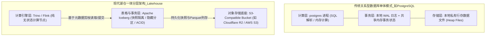
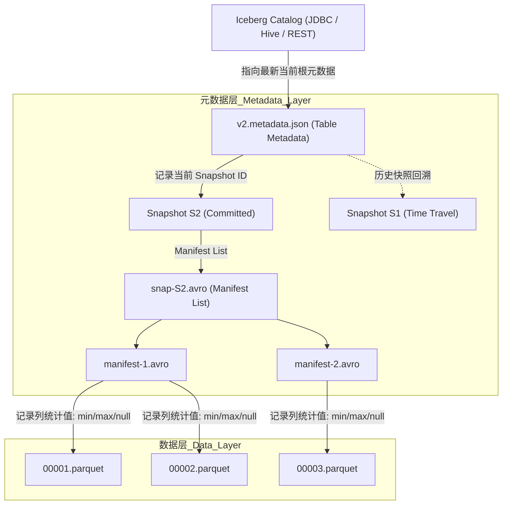
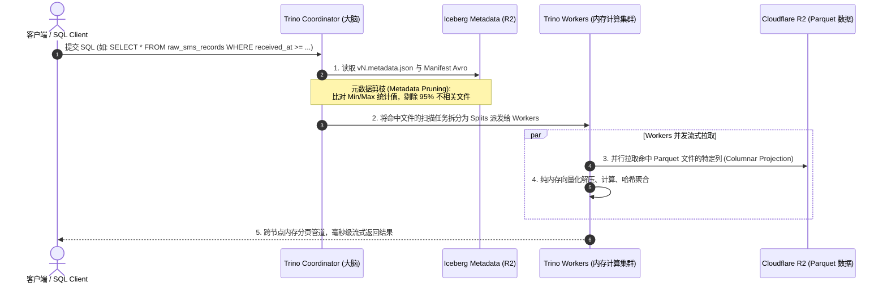

# 从存算一体到现代湖仓：对标传统关系型数据库透视 Bucket + Iceberg + Trino 的物理本质

## 1. 架构本质：从“存算强绑定”到“三权分立”

在传统关系型数据库（如 PostgreSQL / MySQL）体系中，计算引擎、元数据管理与物理存储被紧密耦合在同一个操作系统进程与宿主机文件系统内：

* **计算层**：单体 `postgres` 守护进程负责 SQL 解析、查询优化、执行计划生成与缓冲区管理；
* **事务层**：依托本地内存中的锁管理器（Lock Manager）与顺序追加的预写日志（WAL - Write Ahead Log）维系 ACID 事务；
* **存储层**：直接操作本地块存储（Block Storage）上的私有行式数据页文件（Heap Files，如 `/var/lib/postgresql/data/base/...`）。

这种强绑定模型虽然保障了单机低并发事务的高内聚，但在现代海量半结构化数据摄入与交互式敏捷分析场景下暴露出致命瓶颈：存储与算力无法独立弹性伸缩、物理文件格式闭源专有导致生态割裂、跨引擎并发写容易引发元数据死锁。

现代数据湖仓（Lakehouse）架构通过将传统数据库的核心组件彻底拆解为三个独立抽象层，重塑了数据系统的分工边界：

三个核心组件在物理本质上分别对应传统数据库的关键构件：

| 湖仓三层栈组件 | 物理本质与规范定位 | 对标传统关系型数据库 (PostgreSQL) |
| :--- | :--- | :--- |
| **Object Bucket (如 R2)** | 分布式高可用对象存储底座，存放不可变物理文件 | 本地块设备文件系统 (`/var/lib/postgresql/data`) |
| **Apache Iceberg** | 开放表格式规范（Table Format），提供快照隔离与 ACID 事务树 | 本地 WAL 日志 + 数据字典系统表 (`pg_class`, `pg_attribute`) |
| **Trino** | 分布式纯内存大规模并行处理（MPP）查询计算引擎 | `postgres` 进程（执行 SQL 解析、CBO 优化、内存流式计算） |

---

## 2. 存储底座 (Object Storage)：不可变文件系统的物理形态

在湖仓架构中，对象存储（如 Cloudflare R2、AWS S3）不再按传统文件系统的层级目录树（Directory Tree）来组织，而是扁平的 Key-Value 寻址对象池。存储在 Bucket 内部的数据具有以下物理特征：

1. **写一次不可变（Write-Once, Read-Many）**：
   任何数据文件一旦被 Flink 或 Spark 写入完成并关闭，即变为物理只读不可变文件。修改或删除数据并不直接原地修改物理文件，而是生成新的文件版本；
2. **开放列式编码（Apache Parquet）**：
   数据不再采用传统数据库的 8KB 物理行存页，而是采用标准的 Parquet 格式列式编码存储。每列数据单独连续排布，配合 Snappy 或 ZSTD 压缩算法，压缩比可达 5:1 至 10:1；
3. **零出网成本与近乎无限吞吐**：
   借助分布式存储协议，读写并发能力摆脱了单块 NVMe SSD 的物理 IOPS 瓶颈，由多节点网卡并发吞吐分摊流量。

---

## 3. 表格式 (Apache Iceberg)：将“一堆文件”抽象为“单张事务表”

若仅在存储桶中存放海量 Parquet 文件，系统充其量只是一个原始数据沼泽（Data Swamp）。查询引擎若要找一条记录，只能执行全量文件暴力扫描（Full Scan）。

**Apache Iceberg 的核心技术使命，是在不可变的对象存储上，用一系列层级自解释的元数据文件，构建出一棵带 ACID 事务特性的快照树（Snapshot Tree）。**

### 3.1 物理层级解析

1. **Catalog (目录层)**：
   仅维护一个轻量原子指针，记录该表当前最新有效的元数据文件物理地址（如 `s3://bucket/metadata/v2.metadata.json`）。在更新快照时，Catalog 执行类似比较并交换（Compare-And-Swap · CAS）的原子操作；
2. **Table Metadata (`vN.metadata.json`)**：
   表的总蓝图，记录字段 Schema 定义、分区规则（Partition Spec）、排序规则，以及按时间递增的历史快照（Snapshot）列表；
3. **Manifest List (`snap-*.avro`)**：
   单次快照提交的直接入口文件，记录了当前快照所包含的所有 Manifest 文件的物理路径，以及各个 Manifest 所涵盖的分区范围；
4. **Manifest File (`*.avro`)**：
   最底层的元数据清单，逐一记录每个具体 Parquet 数据文件的物理路径、文件大小、行数，以及各列的关键统计指标（下界 Minimum、上界 Maximum、空值数量 Null Count）。

### 3.2 事务与隔离机制的本质

传统数据库依赖锁管理器实现隔离级别。Iceberg 则通过**写时快照隔离（Snapshot Isolation via Copy-on-Write / Merge-on-Read）**完全消除了读写锁冲突：

* **读操作**：任何查询引擎在开始时绑定特定的 Snapshot ID，后续读取全程基于该不可变快照树进行，**读操作永不阻塞写操作**；
* **写操作**：并发任务在独立的内存或工作区中写入新 Parquet 文件，并生成新的 Manifest，只有在完成全量写入后，才向 Catalog 发起元数据原子替换请求。提交成功后，快照自增至 `S(N+1)`；若发生冲突，则自动执行乐观并发控制（OCC）重试。
* **审计回溯（Time Travel）**：由于历史快照及底层的 Parquet 文件在提交后未被立刻物理物理删除，查询引擎只需声明 `FOR TIMESTAMP AS OF` 或 `FOR VERSION AS OF`，即可直接调阅表在任意历史毫秒时刻的完整状态。

---

## 4. 计算引擎 (Trino)：纯内存大规模并行流式查询

Trino（原 PrestoSQL）本身是一个**无存储的、纯无状态（Stateless）的分布式计算引擎**。

### 4.1 查询性能为什么能达到毫秒级？

很多开发者直觉认为“从远程对象存储读文件一定很慢”，但 Trino + Iceberg 的协同优化打破了这一限制：

1. **元数据层极端剪枝（Metadata Pruning & File Skipping）**：
   Trino Coordinator 在 SQL 解析与计划生成阶段，直接读取轻量的 Avro Manifest 文件。若 SQL 带有过滤条件（如 `WHERE imap_uid > 1000`），Coordinator 比对 Manifest 里的 `min(imap_uid)` 和 `max(imap_uid)`，即可在不与任何 Parquet 数据文件发生网络 I/O 的前提下，直接在内存中剔除 90% 以上的不相关文件；
2. **列裁剪与行组跳过（Column Projection & RowGroup Skipping）**：
   进入 Worker 计算阶段后，Trino 仅根据 SQL 所选取的列名（如仅选了 `msg_uid`, `sender`），向对象存储发起 HTTP 范围分段请求（HTTP Range Request），只拉取 Parquet 文件末尾的 Footer 元数据和对应列的数据页，避免全宽表网络传输；
3. **纯内存无落盘流式架构（In-Memory Streaming Pipelining）**：
   Trino 与 Spark 阶段落盘（Shuffle Spill）机制不同，各执行节点之间通过 TCP 内存队列流式传递数据包，数据边读取边在 CPU 缓存中向量化运算（Vectorized Execution），从计算到网络吐出全链路无二次磁盘写入。

---

## 5. 总结与架构全景映射

在传统的数据库思维中，性能与事务通常被视作存储引擎的“内置黑盒特性”。

通过拆解现代 Lakehouse，可以看到一套职责极其清晰的工业化分工：

* **Cloudflare R2 (Bucket)**：充当容量近乎无限、按需计费的物理字节仓库，解决“**持久存储与网络分发**”问题；
* **Apache Iceberg (Table Format)**：充当表的逻辑骨架与事务账本，用 Avro 元数据树规范“**什么是表、怎么切分事务、怎样做快照隔离**”；
* **Apache Trino (Query Engine)**：充当纯粹的高效算力中枢，利用分布式内存流水线专职解决“**如何以最优成本把 SQL 转换为并行网络流并快速计算出结果**”。

这种“三权分立”的模块化架构，使得系统既具备了传统关系型数据库一致严密的 ACID 事务边界与标准 ANSI SQL 交互界面，又摆脱了专有磁盘与常驻主机的物理掣肘，达成了存储成本、弹性扩容与开放生态之间的平衡。
