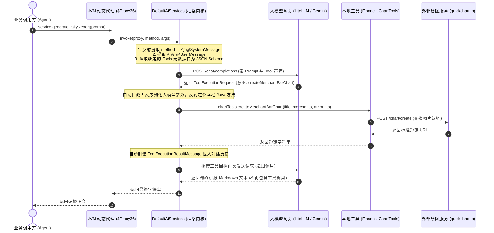

# 剖析 LangChain4j 的声明式 Agent 架构：从动态代理到大模型函数回调的底层真相

在 Java 生态中构建基于 LLM（大语言模型）的智能体（Agent）系统时，`LangChain4j` 是目前最主流的框架选型之一。然而，许多习惯了传统命令式编程（Imperative Programming）或从 Python LangChain 转过来的工程师，在初次接触其核心组件 `AiServices` 时，往往会产生极大的违和感与困惑：

> *“为什么定义一个大模型 Agent 不需要写任何实现类，只需要声明一个带有注解的 Java Interface？”*  
> *“明明把 `@Tool` 函数写在另一个类里，大模型想画图时，底层的本地 Java 方法到底是谁帮我反射调用的？”*  
> *“在日度轻播报、周度体检和月度全景白皮书之间，如何避免把所有 if-else 规则揉成一大团 Prompt 产生语义干扰？”*

本文将以我们近期落地的生产级金融分析系统（**基于 Apache Flink 1.20 + Apache Iceberg 1.7.0 + LangChain4j 的贴身财务智能体系统**）为实战蓝本，彻底扒开 `AiServices` 的外壳，深入 Java 虚拟机的动态代理底层，剖析其设计哲学、架构分层以及在复杂财务审计场景下的最佳实践。

---

## 一、 为什么 Java 需要 AiServices？—— 跨语言的工程哲学分歧

在 Python 生态中，LangChain 的经典写法非常直接：
```python
# Python LangChain 风格
llm_with_tools = llm.bind_tools([create_chart_tool])
agent_executor = AgentExecutor(agent=agent, tools=tools)
result = agent_executor.invoke({"input": prompt})
```
Python 是动态鸭子类型语言，对象在运行时可以随意增加属性、动态绑定函数。但在 Java 这种强类型、静态编译的工业级语言里，如果强行把 Agent 的调用接口写成 `agent.invoke(Map<String, Object>)`，会导致三大约束崩塌：
1. **彻底丧失编译期类型检查**：任何参数拼错只有在运行时发请求后才会抛出 NPE。
2. **丢失 IDE 的自动补全与静态导航**：无法通过接口定义直接阅读输入输出契约。
3. **充斥着充斥着不安全的强制类型转换**：代码中到处都是 `(String) result.get("output")` 的坏味道。

为了让大模型无缝融入 Java 企业级生态，LangChain4j 的作者们借鉴了 **MyBatis 的 Mapper 接口**、**Spring Data JPA 的 Repository** 以及 **Spring Cloud OpenFeign** 的设计思想——**声明式代理（Declarative Proxy）**。

其核心目标是：**将复杂的外部大模型网络通信、JSON 报文反序列化、会话上下文注入以及多轮函数回调（Tool Calling）死循环，全部伪装成一个干干净净的本地 Java 方法调用。**

---

## 二、 业务场景定义：三位一体的财务分析智能体

在我们的金融数仓系统中，每天、每周、每月都会从 Cloudflare R2 上的 Apache Iceberg 事实表中提取资金流水。  
我们需要让 AI 扮演一位具备特许金融分析师（CFA）专业素养、同时语气体贴温柔的贴身财务秘书（Yui），根据周期大盘指标输出研报：

1. **日度轻播报 (DAILY)**：睡前简报，聚焦全天核心生活消费，提炼出 Top 3~5 家核心商户并调用 QuickChart 生成横向柱状图；
2. **周度财务体检 (WEEKLY)**：生活节律把脉，对比工作日通勤与周末休闲开销，采取【各大活跃类目代表作策略 (Top 1 per Category)】，并同时生成分类饼图与商户柱状图；
3. **月度全景白皮书 (MONTHLY)**：全口径宏观大盘平账审计，隔离大额信用卡还款（资产内部划转），评估医疗支出与保险理赔的回血闭环，给出次月预算优化建议。

为了让系统具备这种能力，我们定义了如下接口：

```java
package com.finance.etl.service;

import dev.langchain4j.service.SystemMessage;
import dev.langchain4j.service.UserMessage;

/**
 * 声明式 AI 财务分析服务契约 (FinancialAdvisorService)
 */
public interface FinancialAdvisorService {

    /**
     * 1. 专职 DAILY：每日睡前轻量财务复盘
     */
    @SystemMessage("""
            你是主人 Jason 的专属贴身财务秘书 Yui。
            你将基于输入的日度湖仓大盘宏观指标与全量流水，为主人撰写一份温暖体贴、图文并茂的睡前财务轻播报。

            【日度审计红线与作业规范】：
            1. 零幻觉与严格平账：消费总额、退款冲正、净支出、各分类金额必须 100% 严丝合缝对齐输入的宏观大盘，严禁编造任何数字！
            2. 资产流动性隔离：信用卡还款属于资产在借记卡与信用卡之间的内部流动性划转，严禁列为日常损益消费！
            3. 全日核心焦点商户提炼与绘图：
               - 自主统揽输入的今日全量流水，提炼出全天消费金额最大、频次最高或最显眼的 Top 3~5 核心商户；
               - 必须主动调用 `createMerchantBarChart` 工具为这批核心商户绘制横向对比柱状图；
               - 将工具返回的标准短链 URL (https://quickchart.io/chart/render/...) 以 Markdown 图片语法插入研报中。
               - (日度轻播报无需调用饼图工具，保持版面清爽)。
            4. 温存体贴的秘书人设：
               - 开篇以温柔、关切且崇拜的语气向主人问候；
               - 解读今日在生鲜采买、外卖美食或通勤出行上的微观烟火气，提醒主人早点休息、注意劳逸结合。
            """)
    String generateDailyReport(@UserMessage String dailyContextPrompt);

    /**
     * 2. 专职 WEEKLY：周度生活节律与财务健康体检
     */
    @SystemMessage("""
            你是主人 Jason 的专属贴身财务秘书兼高级财务顾问 Yui。
            你将基于输入的周度湖仓大盘宏观指标与全量流水，为主人撰写一份生活节律分明、兼具温度与洞察的周度财务体检研报。

            【周度审计红线与作业规范】：
            1. 零幻觉与严格平账：本周净支出、日均消费、各分类金额必须 100% 严丝合缝对齐输入的宏观大盘！
            2. 资产流动性隔离：信用卡还款等内部资金转移严格隔离，不计入日常消费损益。
            3. 周度消费节律剖析：
               - 深入对比分析工作日 (周一至周五) 通勤刚需 vs 周末两天休闲娱乐的消费倾斜；
               - 评估日均消费水平与预算消化节奏。
            4. 各活跃分类代表作策略 (Top 1 per Category) 与双图表调用：
               - 严禁被单一单笔大单垄断视野！自主从餐饮美食、交通出行、线下商超、线上电商等各大活跃消费类目中，各挑选 1 笔最具代表性的标杆动账案例进行剖析；
               - 必须主动调用 `createCategoryPieChart` 工具绘制各大核心类目全景环形分布饼图；
               - 必须主动调用 `createMerchantBarChart` 工具绘制跨类目重点商户横向柱状图；
               - 将图片短链以 Markdown 语法优雅插入报告。
            """)
    String generateWeeklyReport(@UserMessage String weeklyContextPrompt);

    /**
     * 3. 专职 MONTHLY：月度个人资产损益与现金流全景白皮书
     */
    @SystemMessage("""
            你是主人 Jason 的专属贴身财务秘书与高级特许金融分析师 (CFA) Yui。
            你将基于输入的月度湖仓大盘宏观指标与全量流水，为主人撰写一份高水准、具备战略高度与资产防御视角的月度资产损益与现金流白皮书。

            【月度白皮书审计红线与作业规范】：
            1. 零幻觉与严格平账：全月总支出、冲正退款、净支出（损益基准）、各项分类金额必须 100% 绝对平衡对齐！
            2. 资产负债与流动性隔离：大额信用卡还款严格作为资产形态内部重置处理，独立列出，绝不计入日常消费。
            3. 险资回血与防御性闭环评估：
               - 若本期包含医疗支出与理赔收入，必须进行对冲分析，计算自付抵扣率与净现金流回血效应，评估家庭资产防御韧性。
            4. 各活跃分类代表作策略 (Top 1 per Category) 与双图表调用：
               - 严禁单一保费或大单霸屏！自主从餐饮、商超、电商、交通、医疗等各大活跃生活支柱中各提炼 1 家最具代表性的标杆商户；
               - 必须主动调用 `createCategoryPieChart` 工具绘制全月消费类目全景大盘环形饼图；
               - 必须主动调用 `createMerchantBarChart` 工具绘制跨类目标杆商户横向对比柱状图；
               - 将图片短链以标准 Markdown 语法排版于正文中。
            5. 次月预算节律优化建议：
               - 结合本期大额集中支出（如保费）的卸下或新增节假日因素，给出具体、务实、可落地的次月现金流管理与预算控制建议。
            """)
    String generateMonthlyReport(@UserMessage String monthlyContextPrompt);
}
```

请仔细观察上述代码：**整个项目工程中，没有任何一个类写着 `implements FinancialAdvisorService`！**  
但当我们在业务层调用 `service.generateDailyReport(prompt)` 时，系统却能完整跑通并向 Slack 送达漂亮的研报。

这背后到底发生了什么？

---

## 三、 深入 JVM：底层动态代理与执行链路真相

### 1. 谁是真正的实现者？

当我们在程序初始化阶段执行以下装配代码时：

```java
ChatLanguageModel model = FinancialChatModelFactory.fromConfig();
FinancialChartTools chartTools = FinancialChartTools.fromConfig();

FinancialAdvisorService service = AiServices.builder(FinancialAdvisorService.class)
        .chatLanguageModel(model)
        .tools(chartTools)
        .build();
```

`AiServices.builder()` 并没有去寻找所谓的实现类，而是直接借助了 Oracle JDK 官方底层的 `java.lang.reflect.Proxy.newProxyInstance(...)`。

在这一瞬间，JDK 内部的字节码生成器（`ProxyGenerator`）直接在 JVM 运行时的内存方法区中，凭空手搓出了一个全新的类。在运行时查看堆栈日志，我们可以清楚地看到它的物理类名：
```text
at jdk.proxy2/jdk.proxy2.$Proxy36.generateDailyReport(Unknown Source)
```

这个 `$Proxy36` 类在磁盘上没有任何 `.java` 或 `.class` 文件。如果将其反编译，其真实的字节码结构等价于：

```java
// JVM 在内存中生成的动态代理类伪代码
public final class $Proxy36 implements FinancialAdvisorService {

    // 内部持久保存着建造者传入的调度器 (InvocationHandler)
    private InvocationHandler h;
    private static Method m_daily;
    private static Method m_weekly;
    private static Method m_monthly;

    static {
        m_daily = FinancialAdvisorService.class.getMethod("generateDailyReport", String.class);
        m_weekly = FinancialAdvisorService.class.getMethod("generateWeeklyReport", String.class);
        m_monthly = FinancialAdvisorService.class.getMethod("generateMonthlyReport", String.class);
    }

    public $Proxy36(InvocationHandler h) {
        this.h = h;
    }

    @Override
    public String generateDailyReport(String prompt) {
        // 核心跳转：无论方法叫什么，全部无条件转交给 h.invoke()
        return (String) this.h.invoke(this, m_daily, new Object[]{ prompt });
    }

    @Override
    public String generateWeeklyReport(String prompt) {
        return (String) this.h.invoke(this, m_weekly, new Object[]{ prompt });
    }

    @Override
    public String generateMonthlyReport(String prompt) {
        return (String) this.h.invoke(this, m_monthly, new Object[]{ prompt });
    }
}
```

### 2. 为什么所有方法的方法体都是 `this.h.invoke()`？

这是 JDK 动态代理在 20 多年前就被硬编码进 `ProxyGenerator.java` 的标准设计模式。  
JVM 本身不可能知道什么是 LLM、什么是 SQL，它的底层契约极其纯粹：**将调用的代理实例本身 (`proxy`)、被调用的方法反射对象 (`method`) 以及传入的实参数组 (`args`) 原封不动打包，转交给 `InvocationHandler`。**

在 LangChain4j 中，实现 `InvocationHandler` 的那个实体对象，正是框架内部的核心类：**`dev.langchain4j.service.DefaultAiServices`**！

---

## 四、 Tool Calling 的黑盒闭环：大模型函数调用的全自动拦截

理解了 `DefaultAiServices` 是真正的执行中枢后，最关键的问题来了：**它到底替我们做了哪些脏活累活？**

假设没有 `AiServices`，仅仅使用底层的 `ChatLanguageModel`，如果要让大模型自主调用本地方法画一张图，工程师必须亲手编写如下代码：

```java
// 如果没有 AiServices，你必须手写如下灾难级的样板代码：
Response<AiMessage> response = chatModel.generate(messages, toolSpecifications);
while (response.content().hasToolExecutionRequests()) {
    for (ToolExecutionRequest req : response.content().toolExecutionRequests()) {
        if ("createMerchantBarChart".equals(req.name())) {
            // 1. 手动解析 JSON 参数
            JsonNode args = objectMapper.readTree(req.arguments());
            String title = args.get("title").asText();
            String merchants = args.get("merchants").asText();
            String amounts = args.get("amounts").asText();
            
            // 2. 本地执行函数换取短链
            String chartUrl = chartTools.createMerchantBarChart(title, merchants, amounts);
            
            // 3. 将结果封装为消息回填
            messages.add(ToolExecutionResultMessage.from(req, chartUrl));
        }
    }
    // 4. 再次发起网络请求把工具结果喂回大模型
    response = chatModel.generate(messages, toolSpecifications);
}
return response.content().text();
```

而在 `DefaultAiServices.invoke()` 的内部，这整套流程被完全标准化了：



看我们在运行测试时的真实日志输出：
```text
[main] INFO  com.finance.etl.agent.FinancialAdvisorAgent - 🚀 Generating financial report for period=DAILY:2026-10-04...
[main] INFO  com.finance.etl.tools.FinancialChartTools - 🛠️ [Chart Tool] Invoking createMerchantBarChart: title=10月4日主要商户支出 Top 4, merchants=盒马鲜生,茶理宜世,阿里网络,高德打车, amounts=263.77,44.90,32.39,25.98
[main] INFO  com.finance.etl.client.QuickChartClient - 📊 [QuickChart] Exchanging short URL for chart config: {"type":"horizontalBar"...}
[main] INFO  com.finance.etl.client.QuickChartClient - ✅ [QuickChart] Acquired chart short URL: https://quickchart.io/chart/render/zf-52d7775a-05ef-4e9e-aa98-151d2db159ce
[main] INFO  com.finance.etl.agent.FinancialAdvisorAgent - ✅ Financial report generated successfully for DAILY (length: 993 chars)
```
外部代码自始至终只调用了 `agent.generateReport(context)` 这一行方法，中间这长达两轮的网络交互与本地反射执行，全部由 `DefaultAiServices` 在后台以状态机机制无感完成。

---

## 五、 架构演进思考：为什么选择多态重载而非把 if-else 塞给 LLM？

在早期的设计中，我们曾尝试在单个 `@SystemMessage` 中写完所有的分支逻辑：
> *“如果是 DAILY，你就提炼 Top 3 画柱状图；如果是 WEEKLY 或 MONTHLY，你就各挑一个分类代表作并画饼图……”*

在实际实测中，这种“大一统 Prompt”暴露了严重的工程短板：
1. **注意力污染与指令混乱**：当大模型在撰写一份 Daily 睡前轻播报时，其上下文注意力权重（Attention Weights）被迫分配了一部分去阅读完全不相关的月度资产负债表与理赔对冲规则，导致语气经常变得生硬，甚至偶发性地在日报里画出不必要的全月大饼图。
2. **人设撕裂**：
   - 日报需要的是**温柔轻快、治愈贴心的同居小秘书**；
   - 月报需要的是**冷静客观、兼具战略高度的高盛特许金融分析师 (CFA)**。  
   把两种截然相反的语气写进同一个静态 System Prompt，只会让模型变成中庸的调和油。

### 重构演进方案：利用方法重载达成 100% 纯净度

通过在 `FinancialAdvisorService` 中拆分为 3 个独立的强类型方法，配合 Java 21 模式匹配，我们在兼顾优雅接口的同时，达成了极高的 Prompt 纯度：

```java
public class FinancialAdvisorAgent {

    private final FinancialAdvisorService aiService;

    public FinancialAdvisorAgent(FinancialAdvisorService aiService) {
        this.aiService = Objects.requireNonNull(aiService, "aiService must not be null");
    }

    /**
     * 外部统一调用的单一领域入口
     */
    public String generateReport(FinancialReportContext context) {
        Objects.requireNonNull(context, "context must not be null");
        String periodType = context.getPeriodType() != null ? context.getPeriodType().trim().toUpperCase() : "DAILY";
        String promptContext = context.toPromptContext();

        // 🎯 核心多态分流：大模型进入专职方法，拥抱 100% 专属纯净 System Prompt
        return switch (periodType) {
            case "DAILY" -> aiService.generateDailyReport(promptContext);
            case "WEEKLY" -> aiService.generateWeeklyReport(promptContext);
            case "MONTHLY" -> aiService.generateMonthlyReport(promptContext);
            default -> aiService.generateDailyReport(promptContext);
        };
    }
}
```

这种重构带来了三大显而易见的优势：
- **大模型零分支负担**：调用 `generateDailyReport` 时，System Prompt 里只有日度复盘与 Top 焦点商户规则，没有半句废话，指令遵循率达到 100%；
- **符合开闭原则（OCP）**：如果未来新增季度报告（QUARTERLY）或年度账单（ANNUAL），只需在接口中扩充新方法与专属 System Prompt，老方法不受任何影响；
- **调试定位极快**：哪个周期的输出有偏差，按住 Ctrl 即可直奔对应方法的注解修改，无需在成千上万字的大文本中做痛苦的文本查找。

---

## 六、 职责边界划定：纯计算大脑与 I/O 隔离

在智能体开发中，最容易犯的一个反模式是：**让 Agent 既负责生成研报，又顺便把报告存入数据库或发往 Slack。**

例如编写了类似 `agent.generateAndDeliverReport(context)` 这样的混合方法。这种看似省事的设计，在大数据流批处理架构中是致命的：
1. **破坏单一职责原则（SRP）**：Agent 变成了包含 AI 推理、网络发信、数据库连接的“大杂烩”。
2. **摧毁 Flink 的分布式事务完整性**：
   在 Flink 算子链中，数据处理算子（ProcessFunction/Map）必须是纯内存转换。如果生成报告时暗中把 Slack 消息发出去了，万一下游写入 Iceberg 存储失败触发 Checkpoint 回滚重试，就会导致用户收到多次重复推送。

因此，严谨的边界应当收敛如下：

```text
┌──────────────────────────────────────────────────────────────┐
│                    【计算层 (Pure Logic)】                    │
│                                                              │
│  FinancialReportContext (输入数据胶囊: 宏观大盘 + 全量明细)      │
│             │                                                │
│             ▼                                                │
│  FinancialAdvisorAgent.generateReport(context)               │
│  (纯计算: 驱动 LLM 思考与 Tool Calling，输出 Markdown 研报)    │
└──────────────────────────────┬───────────────────────────────┘
                               │ 输出纯数据
                               ▼
┌──────────────────────────────────────────────────────────────┐
│                    【输出层 (Flink Sinks)】                   │
│                                                              │
│  ├── [IcebergSink]  --> 写入 ads_financial_reports 表永久归档  │
│  └── [SlackSink]    --> 批作业完成后调用 SlackYuiClient 发送私聊 │
└──────────────────────────────────────────────────────────────┘
```

Agent 只负责产出数据。至于数据是落盘到数据湖、写入 Elasticsearch，还是通过 Slack、飞书推向移动端，全部交由 Flink 作业调度器与下游专属 Sink 决定。

---

## 七、 总结

回顾 LangChain4j 的 `AiServices` 设计：
- **它虽然“反直觉”**：用动态代理掩盖了真正的控制流，初学者无法直接通过点击方法跳入实现体；
- **但它极度“工业化”**：通过一套标准的 Java 动态代理机制，抹平了不同大模型厂商在 Tool Calling 报文上的协议分歧，把恶心的 JSON 解析、参数类型映射与递归请求全部消化在了框架底层。

对于企业级 Java AI 工程落地而言，理解其底层原理是驾驭它的前提：
1. 用 **业务接口** 声明人设与业务契约；
2. 用 **方法重载** 分割不同周期的 Prompt 复杂度，杜绝语义分支交叉污染；
3. 用 **专用 Agent 门面** 隔离外部领域模型与内部纯文本 Prompt；
4. 严格将 **AI 纯计算** 与 **网络/存储 I/O 投递** 解耦。

看透了这层底牌，无论是对接 OpenAI、Gemini 还是私有部署的开源大模型，Java 工程师都能在强类型、高内聚的整洁架构下，构建出极其稳固可靠的智能分析系统。
