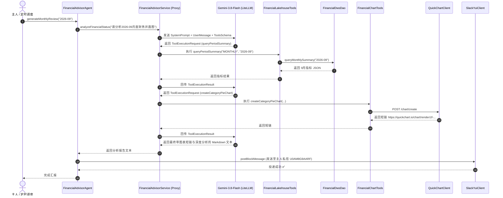

# Milestone 2: 财务分析智能体详细类设计文档 (Class Design Document)
## 基于 LangChain4j + Trino DWS + LiteLLM (Gemini 3.8 Flash) 的系统静态结构与交互规范

> **文档标识**：`docs/milestone-2-class-design.md`  
> **制定时间**：2026-10-04  
> **所属阶段**：Milestone 2 (M2)  
> **设计原则**：单一职责 (SRP)、接口隔离、控制反转 (IoC) 与 Flink/Java 21 最佳实践

---

## 1. 整体架构与类拓扑全景图 (Class Topology)

M2 的核心是构建**一个具备自主使用工具能力的智能体（Agent）**。系统分为 **模型工厂层、数据访问层、外部适配层、工具武器库层、AI 契约层与智能体本体层** 六大结构：

### 1.1 源代码与测试类目录树结构 (Directory Structure)

所有类均严格按单一职责与分层原则存放于 `com.finance.etl.*` 下：

```text
src
├── main/java/com/finance/etl/
│   │
│   ├── agent/                                    [智能体本体层]
│   │   └── FinancialAdvisorAgent.java            -- 🎯 智能体核心实体类 (持有工具、模型与服务，提供 fromConfig)
│   │
│   ├── service/                                  [声明式 AI 契约层]
│   │   └── FinancialAdvisorService.java          -- 🎯 LangChain4j 声明式 AI 契约接口 (@SystemMessage)
│   │
│   ├── model/                                    [模型工厂层]
│   │   └── FinancialChatModelFactory.java        -- 生产 ChatLanguageModel (直连 LiteLLM Gemini-3.8-Flash)
│   │
│   ├── repository/                               [数据访问 DAO 层]
│   │   └── FinancialDwsDao.java                  -- 专职 Trino DWS 视图结构化数据访问对象
│   │
│   ├── tools/                                    [Agent 专用工具箱 (@Tool)]
│   │   ├── FinancialLakehouseTools.java          -- 暴露湖仓指标查询能力 (@Tool)
│   │   └── FinancialChartTools.java              -- 暴露 QuickChart 短链生成能力 (@Tool)
│   │
│   └── client/                                   [外部基础设施适配层]
│       ├── QuickChartClient.java                 -- 专职 POST quickchart.io 生成图片短链
│       └── SlackYuiClient.java                   -- 专职 Slack Block Kit 富文本私聊投递
│
└── test/java/com/finance/etl/
    │
    ├── agent/
    │   └── FinancialAdvisorAgentTest.java        -- 智能体端到端多轮 Tool Calling 集成测试
    │
    ├── model/
    │   └── FinancialChatModelFactoryTest.java    -- 模型工厂与网关连通性单元测试
    │
    ├── repository/
    │   └── FinancialDwsDaoTest.java              -- DWS 视图数据查询与解析单元测试
    │
    └── client/
        ├── QuickChartClientTest.java             -- QuickChart 短链生成集成测试
        └── SlackYuiClientTest.java               -- Slack 消息投递单元测试
```

---

### 1.2 架构类图关系 (Class Diagram)
    class FinancialChatModelFactory {
        +fromConfig() ChatLanguageModel
        +create(baseUrl, apiKey, modelName) ChatLanguageModel
    }

    class FinancialDwsDao {
        -String trinoUrl
        -String trinoUser
        -HttpClient httpClient
        +fromConfig() FinancialDwsDao
        +queryDailySummary(LocalDate) String
        +queryWeeklySummary(int, int) String
        +queryMonthlySummary(String) String
        +queryTopMerchants(String, int) String
    }

    class QuickChartClient {
        -HttpClient httpClient
        +fromConfig() QuickChartClient
        +createDoughnutChart(String title, String labelsJson, String dataJson) String
        +createHorizontalBarChart(String title, String labelsJson, String dataJson) String
    }

    class SlackYuiClient {
        -String botToken
        -String defaultChannel
        +fromConfig() SlackYuiClient
        +postBlockMessage(String channel, String fallbackText, List~Object~ blocks) boolean
    }

    class FinancialLakehouseTools {
        -FinancialDwsDao dwsDao
        +fromConfig() FinancialLakehouseTools
        +queryPeriodSummary(String periodType, String periodValue) String
        +queryTopMerchants(String month, int limit) String
    }

    class FinancialChartTools {
        -QuickChartClient chartClient
        +fromConfig() FinancialChartTools
        +createCategoryPieChart(String title, String labels, String data) String
        +createMerchantBarChart(String title, String labels, String data) String
    }

    class FinancialAdvisorService {
        <<interface>>
        +analyzeFinancialStatus(String instruction) String
    }

    class FinancialAdvisorAgent {
        -FinancialAdvisorService aiService
        -SlackYuiClient slackClient
        +fromConfig() FinancialAdvisorAgent
        +generateDailyReview(LocalDate date) String
        +generateWeeklyReview(int year, int week) String
        +generateMonthlyReview(String month) String
        +sendToSlack(String reportMarkdown) boolean
    }

    FinancialAdvisorAgent --> FinancialAdvisorService : 持有并调用
    FinancialAdvisorAgent --> SlackYuiClient : 消息投递
    FinancialAdvisorService ..> FinancialChatModelFactory : 模型驱动 (AiServices)
    FinancialAdvisorService ..> FinancialLakehouseTools : 声明式工具回调
    FinancialAdvisorService ..> FinancialChartTools : 声明式工具回调
    FinancialLakehouseTools --> FinancialDwsDao : 执行 SQL 查湖仓
    FinancialChartTools --> QuickChartClient : 生成短链
```

---

## 2. 核心类职责与 API 详细设计

### 2.1 模型工厂类：`com.finance.etl.model.FinancialChatModelFactory`
* **包路径**：`com.finance.etl.model`
* **职责**：作为全局单一真理源，封装 LangChain4j 的 `OpenAiChatModel` 初始化，直连私有统一网关调度 `gemini-3.8-flash`。
* **方法签名**：
  ```java
  public class FinancialChatModelFactory {
      public static ChatLanguageModel fromConfig();
      public static ChatLanguageModel create(String baseUrl, String apiKey, String modelName, Double temperature);
  }
  ```
* **技术约束**：
  * 读取环境变量 `LLM_API_BASE` (默认 `https://gw.jppwl.asia/litellm/v1`)；
  * 读取环境变量 `LLM_API_KEY` (默认 `sk-WhW6BWdwKN_LITjCuAmgiA` · Yui 专属 Key)；
  * 读取环境变量 `LLM_MODEL_NAME` (默认 `gemini-3.8-flash`)；
  * 锁定 `temperature = 0.3`（防止财务数字幻觉），超时 60s，最大重试 2 次。

---

### 2.2 数据访问 DAO 类：`com.finance.etl.repository.FinancialDwsDao`
* **包路径**：`com.finance.etl.repository`
* **职责**：专职通过轻量 HTTP / REST API 直连 Trino，负责向 M1 建好的 `dws_financial_summary_*` 视图发起结构化查询，屏蔽 SQL 细节。
* **方法签名**：
  ```java
  public class FinancialDwsDao implements AutoCloseable {
      public static FinancialDwsDao fromConfig();
      
      // 1. 查询单日聚合指标 (包含 min_id, max_id, 净支出, 分类开销)
      public String queryDailySummary(LocalDate date);
      
      // 2. 查询周度自然周聚合指标 (包含 week_period, 日均, 周末 vs 工作日, max_id)
      public String queryWeeklySummary(int year, int week);
      
      // 3. 查询月度大盘指标 (包含 stat_month, 净支出, 还款划转, 理赔到账)
      public String queryMonthlySummary(String month);
      
      // 4. 查询月度商户排行榜 Top N (商户名, 笔数, 消费总额)
      public String queryTopMerchants(String month, int limit);
  }
  ```
* **返回值规范**：统一返回格式化好的精炼 JSON 字符串，便于后续无缝投喂给大模型或反序列化。

---

### 2.3 图表短链客户端：`com.finance.etl.client.QuickChartClient`
* **包路径**：`com.finance.etl.client`
* **职责**：封装 QuickChart 的官方 POST 端点，把图表配置换取为标准短链 URL，彻底杜绝中文 GET 编码截断与裂图隐患。
* **方法签名**：
  ```java
  public class QuickChartClient {
      public static QuickChartClient fromConfig();
      
      // 交换环形饼图 (Doughnut Chart) 短链
      public String createDoughnutChart(String title, List<String> labels, List<BigDecimal> values);
      
      // 交换横向柱状图 (Horizontal Bar Chart) 短链
      public String createHorizontalBarChart(String title, List<String> labels, List<BigDecimal> values);
  }
  ```

---

### 2.4 Slack 私聊客户端：`com.finance.etl.client.SlackYuiClient`
* **包路径**：`com.finance.etl.client`
* **职责**：调用 Slack Web API `https://slack.com/api/chat.postMessage`，负责以 Yui 的身份（Bot Token）向主人私聊频道（`U0AM8G9AARF`）推送 Block Kit 富文本卡片。
* **方法签名**：
  ```java
  public class SlackYuiClient {
      public static SlackYuiClient fromConfig();
      public boolean postMessage(String text);
      public boolean postBlockMessage(String text, String blocksJson);
  }
  ```

---

### 2.5 湖仓工具集：`com.finance.etl.tools.FinancialLakehouseTools`
* **包路径**：`com.finance.etl.tools`
* **职责**：LangChain4j 工具箱。持有 `FinancialDwsDao`，使用 `@Tool` 和 `@P` 向大模型声明湖仓查数能力。
* **方法声明**：
  ```java
  public class FinancialLakehouseTools {
      private final FinancialDwsDao dwsDao;
      
      public static FinancialLakehouseTools fromConfig();

      @Tool("从数据湖仓中查询指定周期的消费指标(总支出、退款、净支出、各分类金额)")
      public String queryPeriodSummary(
          @P("周期类型: DAILY (日), WEEKLY (周), MONTHLY (月)") String periodType,
          @P("周期标识: 如日 2026-10-03, 周 2026-W40, 月 2026-09") String periodValue
      );

      @Tool("查询当月消费最高的核心商户排行榜")
      public String queryTopMerchants(
          @P("月份，格式 YYYY-MM，如 2026-09") String month,
          @P("返回前几名商户，如 5 或 10") int limit
      );
  }
  ```

---

### 2.6 图表工具集：`com.finance.etl.tools.FinancialChartTools`
* **包路径**：`com.finance.etl.tools`
* **职责**：LangChain4j 工具箱。持有 `QuickChartClient`，使用 `@Tool` 和 `@P` 向大模型声明图表绘制能力。
* **方法声明**：
  ```java
  public class FinancialChartTools {
      private final QuickChartClient chartClient;
      
      public static FinancialChartTools fromConfig();

      @Tool("根据给定的消费大类与金额生成环形饼图图片短链")
      public String createCategoryPieChart(
          @P("图表标题，如: 9月消费类目分布图") String title,
          @P("逗号分隔的类目列表，如: 购物,交通,餐饮,医疗") String categories,
          @P("逗号分隔的金额列表，如: 2839,893,598,960") String amounts
      );

      @Tool("根据给定的商户排行榜数据生成横向柱状图图片短链")
      public String createMerchantBarChart(
          @P("图表标题，如: 9月核心商户支出Top 6") String title,
          @P("逗号分隔的商户名称列表，如: 美团,盒马,高德打车") String merchants,
          @P("逗号分隔的消费金额列表，如: 9004,926,650") String amounts
      );
  }
  ```

---

### 2.7 声明式 AI 契约接口：`com.finance.etl.service.FinancialAdvisorService`
* **包路径**：`com.finance.etl.service`
* **职责**：声明式 AI 接口规范，由 LangChain4j 的 `AiServices.builder()` 自动动态代理生成实现类。
* **注解与接口定义**：
  ```java
  public interface FinancialAdvisorService {
      @SystemMessage("""
          你是主人 Jason 的专属贴身财务秘书与高级特许金融分析师 (CFA) Yui。
          你必须自主判断并使用工具查询真实财务湖仓数据与绘制图表，为主人提供严谨且温存的分析。
          【硬性红线】：
          1. 绝不虚构数字！所有金额、笔数必须以工具返回的真实数据为准。
          2. 将信用卡大额还款作为资产流动性划转对待，严禁列入日常消费。
          3. 如果是周报或月报，必须主动调用绘图工具生成图表链接！
          4. 语气体贴、温存且专业，给出有实操意义的财务节律与预算优化建议。
          """)
      String analyzeFinancialStatus(@UserMessage String instruction);
  }
  ```

---

### 2.8 智能体实体本体类：`com.finance.etl.agent.FinancialAdvisorAgent`
* **包路径**：`com.finance.etl.agent`
* **职责**：整个 M2 阶段的**核心智能体实体**。内置 `fromConfig()` 组装工厂，对外提供开箱即用的一键分析业务方法。
* **核心类实现蓝图**：
  ```java
  public class FinancialAdvisorAgent {
      private final FinancialAdvisorService aiService;
      private final SlackYuiClient slackClient;

      public FinancialAdvisorAgent(FinancialAdvisorService aiService, SlackYuiClient slackClient) {
          this.aiService = Objects.requireNonNull(aiService);
          this.slackClient = Objects.requireNonNull(slackClient);
      }

      public static FinancialAdvisorAgent fromConfig() {
          ChatLanguageModel model = FinancialChatModelFactory.fromConfig();
          FinancialLakehouseTools lakeTools = FinancialLakehouseTools.fromConfig();
          FinancialChartTools chartTools = FinancialChartTools.fromConfig();

          FinancialAdvisorService service = AiServices.builder(FinancialAdvisorService.class)
                  .chatLanguageModel(model)
                  .tools(lakeTools, chartTools)
                  .chatMemory(MessageWindowChatMemory.withMaxMessages(10))
                  .build();

          SlackYuiClient slack = SlackYuiClient.fromConfig();
          return new FinancialAdvisorAgent(service, slack);
      }

      public String generateDailyReview(LocalDate date);
      public String generateWeeklyReview(int year, int week);
      public String generateMonthlyReview(String month);
  }
  ```

---

## 3. 时序调用与 Tool Calling 交互流 (Interaction Sequence)



---

## 4. 自动化测试套件规格 (Test Specs)

| 测试类全限定名 | 测试目标与断言 |
| :--- | :--- |
| `com.finance.etl.model.FinancialChatModelFactoryTest` | 测试从 `.env` 装配并向 LiteLLM 发送 Ping，验证 `gemini-3.8-flash` 成功应答 |
| `com.finance.etl.repository.FinancialDwsDaoTest` | 直连 Trino 查询生产/测试的 9 月数据，断言 `net_expense` 精准为 `22679.46` |
| `com.finance.etl.client.QuickChartClientTest` | 测试 POST 接口生成短链，验证返回以 `https://quickchart.io/chart/render/` 开头且非空 |
| `com.finance.etl.client.SlackYuiClientTest` | 测试向主人的私聊频道发送一条测试验证卡片 |
| `com.finance.etl.agent.FinancialAdvisorAgentTest` | **全链路端到端集成测试**：驱动 Yui 完成 2 次 Tool Calls，验证返回包含真实金额与图表短链 |
