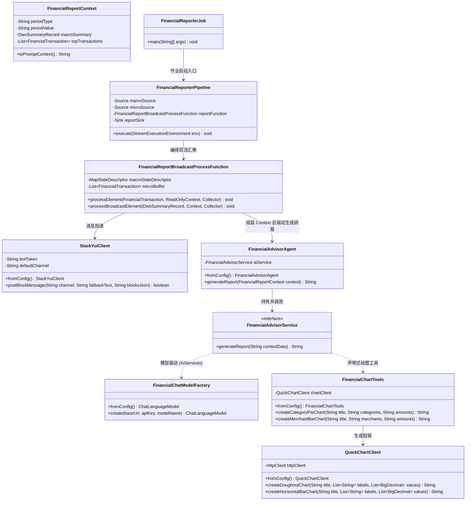
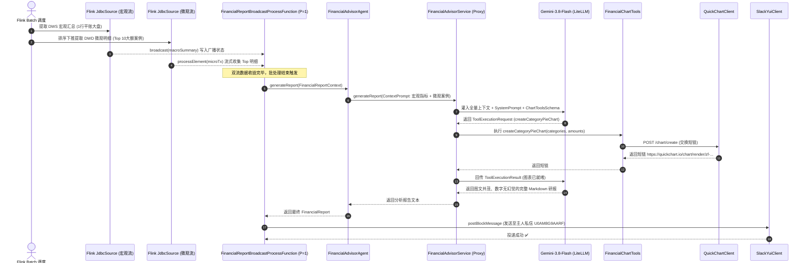

# Milestone 2: 财务分析智能体详细类设计文档 (Class Design Document)
## 基于 LangChain4j + Trino DWS + LiteLLM (Gemini 3.8 Flash) 的系统静态结构与交互规范

> **文档标识**：`docs/milestone-2-class-design.md`  
> **制定时间**：2026-10-04  
> **所属阶段**：Milestone 2 (M2)  
> **设计原则**：单一职责 (SRP)、接口隔离、控制反转 (IoC) 与 Flink/Java 21 最佳实践

---

## 1. 整体架构与类拓扑全景图 (Class Topology)

M2 的核心是构建**一个具备自主使用工具能力的智能体（Agent）**。系统分为 **模型工厂层、数据访问层、外部适配层、工具武器库层、AI 契约层与智能体本体层** 六大结构：

### 1.1 源代码与测试类目录树结构 (Directory Structure)

所有类均严格按单一职责与分层原则存放于 `com.finance.etl.*` 下：

```text
src
├── main/java/com/finance/etl/
│   │
│   ├── agent/                                    [智能体本体层]
│   │   └── FinancialAdvisorAgent.java            -- 🎯 智能体核心实体类 (持有工具、模型与服务，提供 fromConfig)
│   │
│   ├── service/                                  [声明式 AI 契约层]
│   │   └── FinancialAdvisorService.java          -- 🎯 LangChain4j 声明式 AI 契约接口 (@SystemMessage)
│   │
│   ├── model/                                    [领域与模型工厂层]
│   │   ├── FinancialChatModelFactory.java        -- 生产 ChatLanguageModel (直连 LiteLLM Gemini-3.8-Flash)
│   │   ├── FinancialReportContext.java           -- 双流汇聚后的结构化财务报表上下文
│   │   └── DwsSummaryRecord.java                 -- Trino JdbcSource 抽取的宏观聚合实体
│   │
│   ├── pipeline/                                 [Flink 拓扑编排层]
│   │   └── FinancialReporterPipeline.java        -- 🎯 编排 DWS 宏观广播流 + DWD 微观流 -> 汇聚算子 -> 投递
│   │
│   ├── jobs/                                     [Flink 批作业启动层]
│   │   └── FinancialReporterJob.java             -- 🎯 统一 Flink 批作业调度入口 (接收 --period 与日期参数)
│   │
│   ├── transform/report/                         [Flink 双流汇聚转换算子]
│   │   └── FinancialReportBroadcastProcessFunction.java -- 双流广播汇聚算子 (DWS宏观流 + DWD微观流, P=1)
│   │
│   ├── tools/                                    [Agent 专用绘图工具箱 (@Tool)]
│   │   └── FinancialChartTools.java              -- 暴露 QuickChart 短链生成能力 (@Tool)
│   │
│   └── client/                                   [外部基础设施适配层]
│       ├── QuickChartClient.java                 -- 专职 POST quickchart.io 生成图片短链
│       └── SlackYuiClient.java                   -- 专职 Slack Block Kit 富文本私聊投递
│
└── test/java/com/finance/etl/
    │
    ├── agent/
    │   └── FinancialAdvisorAgentTest.java        -- 智能体双流上下文驱动报告生成集成测试
    │
    ├── model/
    │   └── FinancialChatModelFactoryTest.java    -- 模型工厂与网关连通性单元测试
    │
    ├── transform/report/
    │   └── FinancialReportBroadcastProcessFunctionTest.java -- 双流广播汇聚算子单元测试
    │
    ├── pipeline/
    │   └── FinancialReporterPipelineTest.java    -- Flink 报表流水线端到端流图集成测试
    │
    └── client/
        ├── QuickChartClientTest.java             -- QuickChart 短链生成集成测试
        └── SlackYuiClientTest.java               -- Slack 消息投递单元测试
```

---

### 1.2 架构类图关系 (Class Diagram)


---

## 2. 核心类职责与 API 详细设计

### 2.1 模型工厂类：`com.finance.etl.model.FinancialChatModelFactory`
* **包路径**：`com.finance.etl.model`
* **职责**：作为全局单一真理源，封装 LangChain4j 的 `OpenAiChatModel` 初始化，直连私有统一网关调度 `gemini-3.8-flash`。
* **方法签名**：
  ```java
  public class FinancialChatModelFactory {
      public static ChatLanguageModel fromConfig();
      public static ChatLanguageModel create(String baseUrl, String apiKey, String modelName, Double temperature);
  }
  ```
* **技术约束**：
  * 读取环境变量 `LLM_API_BASE` (默认 `https://gw.jppwl.asia/litellm/v1`)；
  * 读取环境变量 `LLM_API_KEY` (默认 `sk-WhW6BWdwKN_LITjCuAmgiA` · Yui 专属 Key)；
  * 读取环境变量 `LLM_MODEL_NAME` (默认 `gemini-3.8-flash`)；
  * 锁定 `temperature = 0.3`（防止财务数字幻觉），超时 60s，最大重试 2 次。

---

### 2.2 宏观与微观 Trino 数据源提取规约
* **宏观指标提取 (`macroSummaryStream`)**：
  - 通过 Trino JDBC 直连执行 `SELECT * FROM iceberg.finance.dws_financial_summary_*`；
  - 映射为 `DwsSummaryRecord` 实体（包含净支出、还款、理赔、各大分类金额、max_id）。
* **微观大额案例提取 (`microDetailStream`)**：
  - 通过 Trino JDBC 直连执行：
    ```sql
    SELECT id, tx_time, tx_type, amount_cny, merchant_clean_name, category_first, counterparty_raw
    FROM iceberg.finance.dwd_financial_transactions
    WHERE is_valid_tx = true 
      AND tx_type = 'EXPENSE'
      AND date_format(tx_time, '%Y-%m') = :statMonth
    ORDER BY amount_cny DESC 
    LIMIT 10;
    ```
  - 利用 SQL 下推直接返回 Top 10 大额交易，映射为 `List<FinancialTransaction>`。

---
      
      // 3. 查询月度大盘指标 (包含 stat_month, 净支出, 还款划转, 理赔到账)
      public String queryMonthlySummary(String month);
      
      // 4. 查询月度商户排行榜 Top N (商户名, 笔数, 消费总额)
      public String queryTopMerchants(String month, int limit);
  }
  ```
* **返回值规范**：统一返回格式化好的精炼 JSON 字符串，便于后续无缝投喂给大模型或反序列化。

---

### 2.3 图表短链客户端：`com.finance.etl.client.QuickChartClient`
* **包路径**：`com.finance.etl.client`
* **职责**：封装 QuickChart 的官方 POST 端点，把图表配置换取为标准短链 URL，彻底杜绝中文 GET 编码截断与裂图隐患。
* **方法签名**：
  ```java
  public class QuickChartClient {
      public static QuickChartClient fromConfig();
      
      // 交换环形饼图 (Doughnut Chart) 短链
      public String createDoughnutChart(String title, List<String> labels, List<BigDecimal> values);
      
      // 交换横向柱状图 (Horizontal Bar Chart) 短链
      public String createHorizontalBarChart(String title, List<String> labels, List<BigDecimal> values);
  }
  ```

---

### 2.4 Slack 私聊客户端：`com.finance.etl.client.SlackYuiClient`
* **包路径**：`com.finance.etl.client`
* **职责**：调用 Slack Web API `https://slack.com/api/chat.postMessage`，负责以 Yui 的身份（Bot Token）向主人私聊频道（`U0AM8G9AARF`）推送 Block Kit 富文本卡片。
* **方法签名**：
  ```java
  public class SlackYuiClient {
      public static SlackYuiClient fromConfig();
      public boolean postMessage(String text);
      public boolean postBlockMessage(String text, String blocksJson);
  }
  ```

---

### 2.5 双流上下文模型：`com.finance.etl.model.FinancialReportContext`
* **包路径**：`com.finance.etl.model`
* **职责**：作为 Flink 内部双流汇聚后的统一载体，承载 Trino JDBC 广播流提取的宏观汇总指标与 DWD 微观明细流提炼的 Top 大额交易。
* **数据结构设计**：
  ```java
  public class FinancialReportContext {
      private String periodType;                       // DAILY, WEEKLY, MONTHLY
      private String periodValue;                      // e.g., 2026-09
      private DwsSummaryRecord macroSummary;           // 宏观平账指标 (净支出, 还款, 理赔, 各大分类金额)
      private List<FinancialTransaction> topTransactions; // 微观动账案例 Top N (商户, 金额, 交易时间, 分类)
      
      public String toPromptContext();                 // 序列化为结构化 Prompt 注入文本
  }
  ```

---

### 2.6 双流广播汇聚算子：`com.finance.etl.transform.report.FinancialReportBroadcastProcessFunction`
* **包路径**：`com.finance.etl.transform.report`
* **职责**：Flink 批处理核心汇聚算子，继承 `BroadcastProcessFunction`。
* **工作流机制**：
  1. `processBroadcastElement(DwsSummaryRecord, Context, Collector)`：
     - 接收 Trino JdbcSource 产出的 1 行宏观大盘统计，存入 `BroadcastState`；
   2. `processElement(FinancialTransaction, ReadOnlyContext, Collector)`：
      - 流式接收周期内的 DWD 交易明细，根据多态周期配置维护微观代表性案例：
        * **Daily 模式**：通过单一大顶堆维护全天消费金额最高的 **Global Top 3 案例**；
        * **Weekly / Monthly 模式**：通过 `Map<String, FinancialTransaction> categoryTopMap` 维护**每个消费大类各自的最大笔消费代表作 (Top 1 per Category)**，确保交通打车、餐饮、生鲜、网购等各维度均有鲜活论据，杜绝单笔大额保费垄断全部案例的缺陷；
  3. Flink Batch 批结束触发：
     - 组装 `FinancialReportContext`，调用 `FinancialAdvisorAgent.generateReport(context)`；
     - 将生成好的 Markdown / 结构化报表数据发射给下游（IcebergSink 与 Slack 投递）。

---

### 2.7 拓扑编排流水线：`com.finance.etl.pipeline.FinancialReporterPipeline`
* **包路径**：`com.finance.etl.pipeline`
* **职责**：遵循整洁架构与依赖倒置原则 (DIP)，专职编排双流数据流向。将宏观 DWS 流与微观 DWD 流通过 BroadcastStream 连接，并挂载 `FinancialReportBroadcastProcessFunction`。
* **架构抽象设计**：
  ```java
  public class FinancialReporterPipeline {
      private final Source<DwsSummaryRecord, ?, ?> macroSource;
      private final Source<FinancialTransaction, ?, ?> microSource;
      private final FinancialReportBroadcastProcessFunction reportFunction;
      private final Sink<String, ?> reportSink;

      public FinancialReporterPipeline(
              Source<DwsSummaryRecord, ?, ?> macroSource,
              Source<FinancialTransaction, ?, ?> microSource,
              FinancialReportBroadcastProcessFunction reportFunction,
              Sink<String, ?> reportSink) { ... }

      public void build(StreamExecutionEnvironment env) {
          // 1. 读取宏观大盘流并声明广播状态
          DataStream<DwsSummaryRecord> macroStream = env.fromSource(macroSource, ...);
          BroadcastStream<DwsSummaryRecord> broadcastMacro = macroStream.broadcast(MACRO_STATE_DESCRIPTOR);

          // 2. 读取微观明细流并与广播流连接
          DataStream<FinancialTransaction> microStream = env.fromSource(microSource, ...);

          // 3. 汇聚并强制单例执行 (Parallelism = 1)
          DataStream<String> reportStream = microStream
                  .connect(broadcastMacro)
                  .process(reportFunction)
                  .setParallelism(1);

          // 4. 挂载输出 Sink
          if (reportSink != null) {
              reportStream.sinkTo(reportSink);
          }
      }
  }
  ```

---

### 2.8 统一调度批作业入口：`com.finance.etl.jobs.FinancialReporterJob`
* **包路径**：`com.finance.etl.jobs`
* **职责**：作为 Flink 批处理的主程序入口类。解析启动参数（如 `--period DAILY --date 2026-10-05`），加载配置环境，构造 Trino 双流 Source，组装 `FinancialReporterPipeline` 并提交执行。
* **运行机制**：
  ```java
  public class FinancialReporterJob {
      public static void main(String[] args) throws Exception {
          // 1. 初始化 Flink 批执行环境与配置
          StreamExecutionEnvironment env = StreamExecutionEnvironment.getExecutionEnvironment();
          env.setRuntimeMode(RuntimeExecutionMode.BATCH);

          // 2. 解析周期参数与对应 Trino SQL
          // 3. 构造双流 Source 与汇聚算子
          // 4. 委托 Pipeline 编排执行并提交作业
      }
  }
  ```

---

### 2.9 图表工具集：`com.finance.etl.tools.FinancialChartTools`
* **包路径**：`com.finance.etl.tools`
* **职责**：LangChain4j 专属绘图工具箱。持有 `QuickChartClient`，使用 `@Tool` 和 `@P` 向大模型声明图表绘制能力。
* **方法声明**：
  ```java
  public class FinancialChartTools {
      private final QuickChartClient chartClient;
      
      public static FinancialChartTools fromConfig();

      @Tool("根据给定的消费大类与金额生成环形饼图图片短链")
      public String createCategoryPieChart(
          @P("图表标题，如: 9月消费类目分布图") String title,
          @P("逗号分隔的类目列表，如: 购物,交通,餐饮,医疗") String categories,
          @P("逗号分隔的金额列表，如: 2839,893,598,960") String amounts
      );

      @Tool("根据给定的商户排行榜数据生成横向柱状图图片短链")
      public String createMerchantBarChart(
          @P("图表标题，如: 9月核心商户支出Top 5") String title,
          @P("逗号分隔的商户名称列表，如: 美团,盒马,高德打车") String merchants,
          @P("逗号分隔的消费金额列表，如: 9004,926,650") String amounts
      );
  }
  ```

---

### 2.10 声明式 AI 契约接口：`com.finance.etl.service.FinancialAdvisorService`
* **包路径**：`com.finance.etl.service`
* **职责**：声明式 AI 接口规范，由 LangChain4j 的 `AiServices.builder()` 自动动态代理生成实现类。
* **注解与接口定义**：
  ```java
  public interface FinancialAdvisorService {
      @SystemMessage("""
          你是主人 Jason 的专属贴身财务秘书与高级特许金融分析师 (CFA) Yui。
          你将基于输入的宏观财务大盘指标与微观明细案例，为主人提供严谨且温存的分析。
          【硬性红线】：
          1. 绝不虚构数字！所有金额、分类必须以输入的宏观指标为准，明细案例以微观列表为准。
          2. 将信用卡大额还款作为资产流动性划转对待，严禁列入日常消费。
          3. 如果是周报或月报，必须主动调用绘图工具生成分类饼图或商户柱状图短链！
          4. 语气体贴、温存且专业，给出有实操意义的财务节律与预算优化建议。
          """)
      String generateReport(@UserMessage String reportContextPrompt);
  }
  ```

---

### 2.11 智能体实体本体类：`com.finance.etl.agent.FinancialAdvisorAgent`
* **包路径**：`com.finance.etl.agent`
* **职责**：整个 M2 阶段的**核心智能体实体**。内置 `fromConfig()` 组装工厂，对外提供开箱即用的一键分析业务方法。
* **核心类实现蓝图**：
  ```java
  public class FinancialAdvisorAgent {
      private final FinancialAdvisorService aiService;
      private final SlackYuiClient slackClient;

      public FinancialAdvisorAgent(FinancialAdvisorService aiService, SlackYuiClient slackClient) {
          this.aiService = Objects.requireNonNull(aiService);
          this.slackClient = Objects.requireNonNull(slackClient);
      }

      public static FinancialAdvisorAgent fromConfig() {
          ChatLanguageModel model = FinancialChatModelFactory.fromConfig();
          FinancialLakehouseTools lakeTools = FinancialLakehouseTools.fromConfig();
          FinancialChartTools chartTools = FinancialChartTools.fromConfig();

          FinancialAdvisorService service = AiServices.builder(FinancialAdvisorService.class)
                  .chatLanguageModel(model)
                  .tools(lakeTools, chartTools)
                  .chatMemory(MessageWindowChatMemory.withMaxMessages(10))
                  .build();

          SlackYuiClient slack = SlackYuiClient.fromConfig();
          return new FinancialAdvisorAgent(service, slack);
      }

      public String generateDailyReview(LocalDate date);
      public String generateWeeklyReview(int year, int week);
      public String generateMonthlyReview(String month);
  }
  ```

---

## 3. 双流广播交互与研报生成时序 (Interaction Sequence)



---

## 4. 自动化测试套件规格 (Test Specs)

| 测试类全限定名 | 测试目标与断言 |
| :--- | :--- |
| `com.finance.etl.model.FinancialChatModelFactoryTest` | 测试从 `.env` 装配并向 LiteLLM 发送 Ping，验证 `gemini-3.8-flash` 成功应答 |
| `com.finance.etl.client.QuickChartClientTest` | 测试 POST 接口生成短链，验证返回以 `https://quickchart.io/chart/render/` 开头且非空 |
| `com.finance.etl.tools.FinancialChartToolsTest` | 测试自动剔除 0 元项并成功生成环形饼图与商户柱状图短链 |
| `com.finance.etl.client.SlackYuiClientTest` | 测试向主人的私聊频道发送一条测试验证卡片 |
| `com.finance.etl.transform.report.FinancialReportBroadcastProcessFunctionTest` | 测试 Flink 广播流汇聚状态逻辑与 Top-N 案例提取正确性 |
| `com.finance.etl.pipeline.FinancialReporterPipelineTest` | 测试 Flink 端到端流图编排与批执行链路 |
| `com.finance.etl.agent.FinancialAdvisorAgentTest` | **全链路端到端集成测试**：驱动 Yui 单轮上下文生成研报，验证平账金额与图表短链 |
