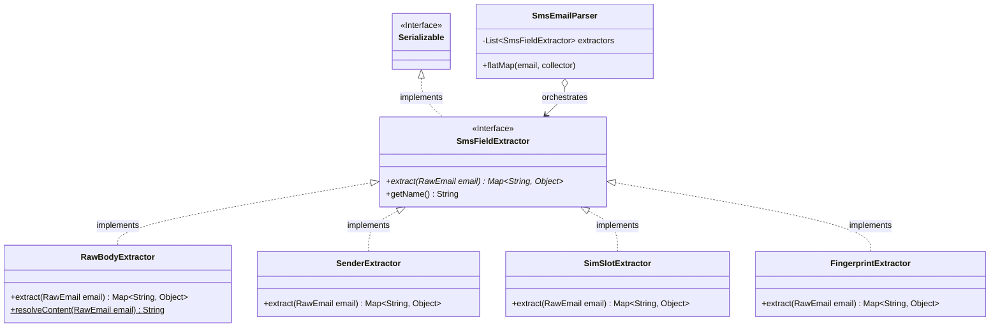
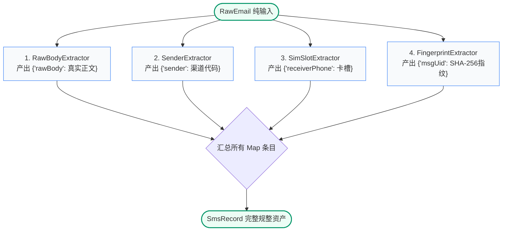

# 动账邮件解析算子 (Parser) 管道化架构与类设计规范

## 1. 业务背景与架构动机

在个人金融数据湖仓（Lakehouse）的 ODS 摄取阶段，原始数据载体是经由手机端（如 SmsForwarder）转发并沉淀至 Gmail IMAP 的 `RawEmail` 对象。

为了将异构、非结构化的邮件报文转化为符合湖仓标准模式（`iceberg.finance.raw_sms_records`）的结构化领域实体 `SmsRecord`，系统必须完成关键字段的清洗与规整：
1. **原始短信报文正文保真提取（`rawBody`）**
2. **金融交易与服务渠道识别（`sender`）**
3. **卡槽与接收手机号识别（`receiverPhone`）**
4. **分布式幂等防重业务指纹生成（`msgUid`）**
5. **[未来扩展字段]**（如金额 `amount`、币种 `currency`、卡号尾号 `cardLast4` 等复合派生字段）

### 为什么选择 `Map<String, Object> extract(RawEmail email)`？
此前曾考虑过单值键值对（`Pair<String, T>`），但现实业务中存在显著的**“多字段强关联提取”**场景：
- 例如一个正规的正则抽取器，跑一次正则匹配，就能同时解析出 `cardLast4`、`amount`、`currency` 三个字段；如果强制一个 Extractor 只能返回单值 `Pair`，同一个耗时的正则计算就必须被重复执行 3 遍！
- 采用 **`Map<String, Object> extract(RawEmail email)`**：
  - **兼顾极简单值**：提取单个字段时，直接返回单条目的不可变 Map（如 `Map.of("sender", "95508")`）；
  - **天然拥抱复合多值（1 对 N 属性）**：同一个 Extractor 随时可以一次性返回多个强关联字段，算一次产出多个 KV；
  - **纯函数、零副作用**：依然只读不可变 `RawEmail`，无外部状态篡改；
  - **单测极速直观**：直接对返回的 Map 进行断言 `assertEquals("95508", result.get("sender"))`。

---

## 2. 核心架构设计与实体拓扑

架构解耦为两个核心层次：
1. **纯函数多值提取契约层 (`SmsFieldExtractor`)**：
   - 输入：只读不可变的 `RawEmail`；
   - 输出：标准的不可变字典映射 `Map<String, Object>`；
   - 无任何外部状态依赖，无副作用，各 Extractor 可独立演进、并发执行与极速单测。
2. **算子编排与汇聚层 (`SmsEmailParser`)**：
   - 作为 Flink 原生 `FlatMapFunction`，维护提取器链条并依次调用各纯函数提取器；
   - 将所有提取出的 Map 条目自动汇总，并通过属性分发器动态规整并赋给 `SmsRecord`。



---

## 3. 契约接口规范定义

### 3.1 纯函数字段提取契约 (`SmsFieldExtractor`)
- **包路径**：`com.finance.etl.transform.extractor`
- **继承约束**：必须实现 `java.io.Serializable`，满足 Flink 分布式算子分发契约。
- **核心签名**：`Map<String, Object> extract(RawEmail email)`

```java
package com.finance.etl.transform.extractor;

import com.finance.etl.model.RawEmail;
import java.io.Serializable;
import java.util.Map;

/**
 * 动账报文字段提取器纯函数契约接口
 */
public interface SmsFieldExtractor extends Serializable {

    /**
     * 纯函数执行：输入只读邮件，返回 [字段名 -> 字段值] 的不可变 Map
     * 支持返回单个字段（如 Map.of("sender", "95508")），
     * 也支持复合抽取器一次性返回多个强关联字段（如 Map.of("amount", 21.24, "cardLast4", "3342")）。
     *
     * @param email 只读的原始邮件输入对象
     * @return 提取成功的字段字典映射 Map (绝不返回 null，若无匹配可返回 Collections.emptyMap())
     */
    Map<String, Object> extract(RawEmail email);

    /**
     * 当前提取器的名称标识
     */
    default String getName() {
        return getClass().getSimpleName();
    }
}
```

---

## 4. 专职提取器组件详细设计



### 4.1 原始全文提取器 (`RawBodyExtractor`)
- **实现契约**：`implements SmsFieldExtractor`
- **纯函数逻辑**：
  ```java
  public static String resolveContent(RawEmail email) {
      if (email == null) return "";
      String body = email.getBody();
      return (body != null && !body.trim().isEmpty()) ? body.trim() : (email.getSubject() != null ? email.getSubject().trim() : "");
  }

  @Override
  public Map<String, Object> extract(RawEmail email) {
      return Map.of("rawBody", resolveContent(email));
  }
  ```

### 4.2 渠道发送方识别器 (`SenderExtractor`)
- **实现契约**：`implements SmsFieldExtractor`
- **业务规则**：
  - 扫描特征文本：`fullContent = (email.getSubject() + " " + email.getBody())`；
  - 广发银行 ➔ `Map.of("sender", "95508")`；
  - 微信支付 ➔ `Map.of("sender", "WECHAT_PAY")`；
  - 支付宝 ➔ `Map.of("sender", "ALIPAY")`；
  - 招商银行 ➔ `Map.of("sender", "95555")`；
  - 兜底默认 ➔ `Map.of("sender", "OTHER")`。

### 4.3 卡槽与接收端识别器 (`SimSlotExtractor`)
- **实现契约**：`implements SmsFieldExtractor`
- **业务规则**：
  - 扫描正文及主题中的卡槽标记：
  - 命中 `SubId：2`、`SIM2` 或 `卡槽2` ➔ `Map.of("receiverPhone", "SIM_SLOT_2")`；
  - 兜底默认 ➔ `Map.of("receiverPhone", "SIM_SLOT_1")`。

### 4.4 业务唯一指纹生成器 (`FingerprintExtractor`)
- **实现契约**：`implements SmsFieldExtractor`
- **业务规则**：
  1. 调用 `RawBodyExtractor.resolveContent(email)` 获取一致的短信全文；
  2. 拼接 `email.getMessageId() + "_" + content`；
  3. 执行 `SHA-256` 单向散列并转为小写十六进制字符串；
  4. 产出 `Map.of("msgUid", sha256Hex)`。

---

## 5. 调度容器与装配实现 (`SmsEmailParser`)

调度容器仅作为 Flink 算子适配器，循环遍历纯函数提取器，获取各个 `Map<String, Object>`，汇总并自动规整实体：

```java
package com.finance.etl.transform;

import com.finance.etl.model.RawEmail;
import com.finance.etl.model.SmsRecord;
import com.finance.etl.transform.extractor.*;
import org.apache.flink.api.common.functions.FlatMapFunction;
import org.apache.flink.util.Collector;
import org.slf4j.Logger;
import org.slf4j.LoggerFactory;

import java.io.Serializable;
import java.time.Instant;
import java.util.HashMap;
import java.util.List;
import java.util.Map;

/**
 * 管道化动账报文解析算子 (SmsEmailParser)
 */
public class SmsEmailParser implements FlatMapFunction<RawEmail, SmsRecord>, Serializable {
    private static final long serialVersionUID = 1L;
    private static final Logger LOG = LoggerFactory.getLogger(SmsEmailParser.class);

    private final List<SmsFieldExtractor> extractors = List.of(
            new RawBodyExtractor(),
            new SenderExtractor(),
            new SimSlotExtractor(),
            new FingerprintExtractor()
    );

    @Override
    public void flatMap(RawEmail email, Collector<SmsRecord> out) throws Exception {
        if (email == null) {
            return;
        }

        // 1. 初始化标准基础实体
        SmsRecord record = new SmsRecord();
        record.setId(email.getImapUid() != null ? email.getImapUid() : System.nanoTime());
        record.setChannel("EMAIL_IMAP");
        record.setReceivedAt(email.getReceivedAt() != null ? email.getReceivedAt() : Instant.now());
        record.setCreatedAt(Instant.now());

        // 2. 纯函数遍历抽取，合并各 Extractor 贡献的所有 KV 字段
        Map<String, Object> enrichedFields = new HashMap<>();
        for (SmsFieldExtractor extractor : extractors) {
            Map<String, Object> fields = extractor.extract(email);
            if (fields != null && !fields.isEmpty()) {
                enrichedFields.putAll(fields);
            }
        }

        // 3. 动态规整至 SmsRecord
        applyFields(record, enrichedFields);

        LOG.info("📱 [Sms Extracted] Sender: {}, Slot: {}, Fingerprint: {}, Body: {}",
                record.getSender(),
                record.getReceiverPhone(),
                record.getMsgUid() != null ? record.getMsgUid().substring(0, Math.min(8, record.getMsgUid().length())) : "N/A",
                record.getRawBody());

        // 4. 发射给下游管道
        out.collect(record);
    }

    private void applyFields(SmsRecord record, Map<String, Object> fields) {
        if (fields.containsKey("rawBody")) record.setRawBody((String) fields.get("rawBody"));
        if (fields.containsKey("sender")) record.setSender((String) fields.get("sender"));
        if (fields.containsKey("receiverPhone")) record.setReceiverPhone((String) fields.get("receiverPhone"));
        if (fields.containsKey("msgUid")) record.setMsgUid((String) fields.get("msgUid"));
    }
}
```

---

## 6. 函数式架构演进收益与度量

| 度量指标 | 单值元组模型 (`Pair<String, T>`) | 多值字典模型 (`Map<String, Object>`) | 架构价值 |
| :--- | :--- | :--- | :--- |
| **复合字段支持** | ❌ 只能 1:1 返回单字段 | **✅ 完美支持 1:N 返回任意多个字段** | 一个正则计算即可同时吐出卡号、金额、币种，性能提升数倍 |
| **空值与跳过语义** | 必须返回空 Pair 或 null | **直接返回 `Collections.emptyMap()`** | 语义极其自然，零空指针隐患 |
| **JDK 标准度** | 需要额外定义 Pair 类 | **100% JDK 核心集合框架 (`java.util.Map`)** | 全平台通用，与各类 JSON/ORM 库天生契合 |
| **纯函数与测试** | 纯函数 | **纯函数，单行断言：`assertEquals("...", map.get("..."))`** | 测试简单度与隔离度达到工业级最高标杆 |
